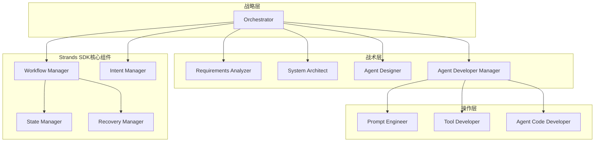

# 设计文档

## 概述

本设计文档描述了灵活的多层级Agent工作流编排系统的技术架构。该系统将现有的串行Graph编排模式转换为支持动态调度、中断恢复和智能路由的多层级架构，同时保持与现有Strands Graph Pattern的兼容性。

## 架构

### 整体架构

系统采用分层架构设计，基于Strands SDK和Python实现，包含以下核心层级：

1. **战略层（Strategic Layer）**：负责最高级决策和整体协调
   - orchestrator（编排器）- 作为整个系统的总协调者

2. **战术层（Tactical Layer）**：负责具体方案设计和架构规划
   - requirements_analyzer（需求分析师）
   - system_architect（系统架构师）
   - agent_designer（代理设计师）
   - agent_developer_manager（代理开发管理者）- 作为操作层的supervisor

3. **操作层（Operational Layer）**：负责具体实现和执行
   - prompt_engineer（提示工程师）
   - tool_developer（工具开发者）
   - agent_code_developer（代理代码开发者）

**监督关系**：
- orchestrator 监督 agent_developer_manager 和战术层的三个agent
- agent_developer_manager 监督操作层的三个agent

### 核心组件架构



## 组件和接口

### 1. 基于Strands SDK的封装组件

#### MultiLayerWorkflowManager
不修改Strands源码，而是创建封装管理器：

```python
from strands.multiagent import GraphBuilder, Graph
from strands import Agent
from typing import Dict, Any, Optional, List
from dataclasses import dataclass

@dataclass
class LayerMetadata:
    """层级元数据，不修改Strands原有结构"""
    layer_type: LayerType
    supervisor: Optional[str] = None
    capabilities: Dict[str, Any] = None
    constraints: Dict[str, Any] = None
    supervised_nodes: List[str] = None

class MultiLayerWorkflowManager:
    """多层级工作流管理器，封装Strands Graph功能"""
    
    def __init__(self):
        self.node_metadata: Dict[str, LayerMetadata] = {}
        self.supervision_relationships: Dict[str, List[str]] = {}
        self.graph_builder = GraphBuilder()
        
    def add_layer_node(self, agent_name: str, node_id: str, layer: LayerType,
                      supervisor: Optional[str] = None,
                      capabilities: Dict = None, constraints: Dict = None):
        """添加层级节点，使用原生Strands API"""
        # 使用现有的agent_factory创建agent
        agent = create_agent_from_prompt_template(
            agent_name=f"system_agents_prompts/agent_build_workflow/{agent_name}",
            env="production",
            version="latest",
            model_id="default"
        )
        
        # 存储层级元数据
        self.node_metadata[node_id] = LayerMetadata(
            layer_type=layer,
            supervisor=supervisor,
            capabilities=capabilities or {},
            constraints=constraints or {},
            supervised_nodes=[]
        )
        
        # 使用原生Strands API添加节点
        self.graph_builder.add_node(agent, node_id)
        
        # 建立监督关系
        if supervisor:
            if supervisor not in self.supervision_relationships:
                self.supervision_relationships[supervisor] = []
            self.supervision_relationships[supervisor].append(node_id)
            
            if supervisor in self.node_metadata:
                self.node_metadata[supervisor].supervised_nodes.append(node_id)
```

#### SupervisorWrapper
封装supervisor功能，不修改Strands源码：

```python
from strands import Agent
from strands.multiagent import Swarm
from utils.agent_factory import create_agent_from_prompt_template
from typing import List, Dict, Any

class SupervisorWrapper:
    """
    Supervisor封装器，实现agent-as-tools模式
    不修改Strands源码，通过封装实现supervisor功能
    """
    
    def __init__(self, supervisor_name: str, team_agents: List[str]):
        self.supervisor_name = supervisor_name
        self.team_agent_names = team_agents
        
        # 创建supervisor agent（使用现有的agent_factory）
        self.supervisor_agent = create_agent_from_prompt_template(
            agent_name=f"system_agents_prompts/agent_build_workflow/{supervisor_name}",
            env="production",
            version="latest",
            model_id="default"
        )
        
        # 创建团队成员agents
        self.team_agents = {}
        for agent_name in team_agents:
            agent = create_agent_from_prompt_template(
                agent_name=f"system_agents_prompts/agent_build_workflow/{agent_name}",
                env="production",
                version="latest",
                model_id="default"
            )
            self.team_agents[agent_name] = agent
        
        # 创建Swarm用于并行协调
        self.swarm = Swarm(
            list(self.team_agents.values()),
            max_handoffs=10,
            max_iterations=15,
            execution_timeout=1800.0,
            node_timeout=600.0
        )
    
    def coordinate_team(self, task: str, mode: str = "dynamic") -> str:
        """
        动态协调团队执行任务
        
        Args:
            task: 要执行的任务
            mode: 协调模式 - dynamic(动态), parallel(并行), sequential(顺序)
        """
        if mode == "parallel":
            # 使用Swarm进行并行协调
            result = self.swarm(task)
            return str(result)
        elif mode == "dynamic":
            # 动态协调模式
            return self._dynamic_coordination(task)
        else:
            # 顺序协调模式
            return self._sequential_coordination(task)
    
    def _dynamic_coordination(self, initial_task: str) -> str:
        """
        动态协调执行，supervisor根据任务情况和agent反馈动态选择下一个agent
        """
        execution_context = {
            "initial_task": initial_task,
            "completed_subtasks": [],
            "current_results": {},
            "next_actions": [],
            "iteration": 0
        }
        
        max_iterations = 10  # 防止无限循环
        final_result = ""
        
        while execution_context["iteration"] < max_iterations:
            execution_context["iteration"] += 1
            
            # Supervisor分析当前情况并决定下一步
            decision_prompt = f"""
            作为{self.supervisor_name}，你正在动态协调团队完成任务。
            
            初始任务：{initial_task}
            
            当前执行上下文：
            - 已完成的子任务：{execution_context["completed_subtasks"]}
            - 当前结果：{execution_context["current_results"]}
            - 迭代次数：{execution_context["iteration"]}
            
            可用团队成员：{', '.join(self.team_agent_names)}
            
            请分析当前情况并做出决策：
            1. 如果任务已完成，返回：TASK_COMPLETED: [最终结果总结]
            2. 如果需要继续，返回：NEXT_AGENT: [agent名称] | SUBTASK: [具体子任务] | CONTEXT: [传递给agent的上下文信息]
            
            决策：
            """
            
            decision = self.supervisor_agent(decision_prompt)
            
            # 解析supervisor的决策
            if "TASK_COMPLETED:" in decision:
                final_result = decision.split("TASK_COMPLETED:")[1].strip()
                break
            elif "NEXT_AGENT:" in decision:
                # 解析下一个要执行的agent和任务
                parts = decision.split("|")
                next_agent_name = None
                subtask = ""
                context = ""
                
                for part in parts:
                    part = part.strip()
                    if part.startswith("NEXT_AGENT:"):
                        next_agent_name = part.split("NEXT_AGENT:")[1].strip()
                    elif part.startswith("SUBTASK:"):
                        subtask = part.split("SUBTASK:")[1].strip()
                    elif part.startswith("CONTEXT:"):
                        context = part.split("CONTEXT:")[1].strip()
                
                # 执行选定的agent
                if next_agent_name in self.team_agents:
                    agent_prompt = f"""
                    子任务：{subtask}
                    
                    上下文信息：{context}
                    
                    之前的执行结果：{execution_context["current_results"]}
                    
                    请执行你的专业任务并返回结果。
                    """
                    
                    agent_result = self.team_agents[next_agent_name](agent_prompt)
                    
                    # 更新执行上下文
                    execution_context["completed_subtasks"].append(f"{next_agent_name}: {subtask}")
                    execution_context["current_results"][next_agent_name] = agent_result
                else:
                    # 如果agent名称不正确，让supervisor重新决策
                    execution_context["current_results"]["error"] = f"未找到agent: {next_agent_name}"
            else:
                # 如果决策格式不正确，尝试重新决策
                execution_context["current_results"]["error"] = "决策格式不正确"
        
        if not final_result:
            # 如果达到最大迭代次数仍未完成，返回当前结果
            final_result = f"任务部分完成，当前结果：{execution_context['current_results']}"
        
        return final_result
    
    def _sequential_coordination(self, task: str) -> str:
        """顺序协调模式"""
        coordination_prompt = f"""
        作为{self.supervisor_name}，你需要协调以下团队成员完成任务：
        
        任务：{task}
        
        团队成员：{', '.join(self.team_agent_names)}
        
        请制定执行计划，并逐步协调团队成员的工作。
        """
        
        coordination_result = self.supervisor_agent(coordination_prompt)
        
        # 根据协调结果，依次调用团队成员
        final_results = []
        for agent_name, agent in self.team_agents.items():
            subtask_prompt = f"""
            基于supervisor的协调计划：
            {coordination_result}
            
            请执行你负责的部分任务。
            """
            result = agent(subtask_prompt)
            final_results.append(f"{agent_name}: {result}")
        
        return "\\n".join(final_results)

    def add_supervisor_to_workflow(self, workflow_manager: 'MultiLayerWorkflowManager', 
                                 node_id: str, layer: LayerType):
        """将supervisor添加到工作流中"""
        # 将supervisor agent添加为普通节点
        workflow_manager.graph_builder.add_node(self.supervisor_agent, node_id)
        
        # 添加层级元数据
        workflow_manager.node_metadata[node_id] = LayerMetadata(
            layer_type=layer,
            supervisor=None,
            capabilities={"coordination": True, "team_management": True},
            constraints={},
            supervised_nodes=self.team_agent_names.copy()
        )
        
        # 建立监督关系
        workflow_manager.supervision_relationships[node_id] = self.team_agent_names.copy()
        
        return self.supervisor_agent

    def build_multilayer_workflow(self) -> Graph:
        """构建多层级工作流，使用原生Strands API"""
        # 战略层
        self.add_layer_node("orchestrator", "orchestrator", LayerType.STRATEGIC)
        
        # 战术层 - 独立agents
        self.add_layer_node("requirements_analyzer", "requirements_analyzer", LayerType.TACTICAL)
        self.add_layer_node("system_architect", "system_architect", LayerType.TACTICAL)
        self.add_layer_node("agent_designer", "agent_designer", LayerType.TACTICAL)
        
        # 战术层 - supervisor
        supervisor = SupervisorWrapper(
            supervisor_name="agent_developer_manager",
            team_agents=["prompt_engineer", "tool_developer", "agent_code_developer"]
        )
        supervisor.add_supervisor_to_workflow(self, "agent_developer_manager", LayerType.TACTICAL)
        
        # 添加依赖边（使用原生Strands API）
        self.graph_builder.add_edge("orchestrator", "requirements_analyzer")
        self.graph_builder.add_edge("requirements_analyzer", "system_architect")
        self.graph_builder.add_edge("system_architect", "agent_designer")
        self.graph_builder.add_edge("agent_designer", "agent_developer_manager")
        
        # 构建并返回原生Strands Graph
        return self.graph_builder.build()
```

### 2. 基于Strands的工作流管理器（Workflow Manager）

负责整体工作流的调度和执行，集成Strands多代理系统：

```python
import json
import os
from typing import Dict, Any, Optional
from strands.multiagent import GraphResult
from utils.config_loader import get_config

class WorkflowManager:
    def __init__(self, state_manager: 'StateManager', 
                 recovery_manager: 'RecoveryManager'):
        self.state_manager = state_manager
        self.recovery_manager = recovery_manager
        self.scheduler = LayeredScheduler()
        self.config = get_config()
        
    def create_multilayer_workflow(self) -> Graph:
        """创建多层级工作流，使用封装的管理器"""
        workflow_manager = MultiLayerWorkflowManager()
        
        # 战略层 - orchestrator（包含意图识别逻辑）
        workflow_manager.add_layer_node("orchestrator", "orchestrator", LayerType.STRATEGIC)
        
        # 战术层 - 独立agents
        workflow_manager.add_layer_node("requirements_analyzer", "requirements_analyzer", LayerType.TACTICAL)
        workflow_manager.add_layer_node("system_architect", "system_architect", LayerType.TACTICAL)
        workflow_manager.add_layer_node("agent_designer", "agent_designer", LayerType.TACTICAL)
        
        # 战术层 - supervisor for operational layer
        supervisor = SupervisorWrapper(
            supervisor_name="agent_developer_manager",
            team_agents=["prompt_engineer", "tool_developer", "agent_code_developer"]
        )
        supervisor.add_supervisor_to_workflow(workflow_manager, "agent_developer_manager", LayerType.TACTICAL)
        
        # 添加依赖边（使用原生Strands API）
        workflow_manager.graph_builder.add_edge("orchestrator", "requirements_analyzer")
        workflow_manager.graph_builder.add_edge("requirements_analyzer", "system_architect")
        workflow_manager.graph_builder.add_edge("system_architect", "agent_designer")
        workflow_manager.graph_builder.add_edge("agent_designer", "agent_developer_manager")
        
        # 构建并返回原生Strands Graph
        return workflow_manager.graph_builder.build()
        
    def execute_workflow(self, task: str, context: Dict = None) -> GraphResult:
        """执行工作流"""
        workflow_id = self._generate_workflow_id()
        
        try:
            # 创建工作流
            workflow = self.create_multilayer_workflow()
            
            # 保存初始状态
            initial_state = WorkflowState(
                workflow_id=workflow_id,
                status=WorkflowStatus.RUNNING,
                current_layer=LayerType.STRATEGIC,
                active_nodes=["orchestrator"],
                completed_nodes=[],
                failed_nodes=[],
                execution_context=context or {},
                created_at=datetime.now(),
                updated_at=datetime.now(),
                checkpoints=[]
            )
            self.state_manager.save_workflow_state(workflow_id, initial_state)
            
            # 执行工作流
            result = workflow(task)
            
            # 更新最终状态
            final_state = initial_state
            final_state.status = WorkflowStatus.COMPLETED if result.status == "success" else WorkflowStatus.FAILED
            final_state.updated_at = datetime.now()
            self.state_manager.save_workflow_state(workflow_id, final_state)
            
            return result
            
        except Exception as e:
            # 处理异常并保存错误状态
            error_state = self.state_manager.load_workflow_state(workflow_id)
            error_state.status = WorkflowStatus.FAILED
            error_state.updated_at = datetime.now()
            self.state_manager.save_workflow_state(workflow_id, error_state)
            raise e
        
    def pause_workflow(self, workflow_id: str) -> bool:
        """暂停工作流"""
        state = self.state_manager.load_workflow_state(workflow_id)
        if state and state.status == WorkflowStatus.RUNNING:
            state.status = WorkflowStatus.PAUSED
            state.updated_at = datetime.now()
            self.state_manager.save_workflow_state(workflow_id, state)
            return True
        return False
        
    def resume_workflow(self, workflow_id: str, resume_point: str = None) -> GraphResult:
        """恢复工作流"""
        return self.recovery_manager.execute_recovery(
            self.recovery_manager.create_recovery_plan(workflow_id, resume_point)
        )
        
    def _generate_workflow_id(self) -> str:
        """生成工作流ID"""
        import uuid
        return f"workflow_{uuid.uuid4().hex[:8]}"
```

### 3. 基于文件系统的状态管理器（State Manager）

管理工作流和代理的状态持久化，使用JSON文件存储：

```python
import json
import os
from datetime import datetime
from typing import Dict, List, Optional
from dataclasses import asdict

class StateManager:
    def __init__(self, storage_path: str = "projects/workflow_states"):
        self.storage_path = storage_path
        os.makedirs(storage_path, exist_ok=True)
        
    def save_workflow_state(self, workflow_id: str, state: WorkflowState):
        """保存工作流状态到JSON文件"""
        state_file = os.path.join(self.storage_path, f"{workflow_id}.json")
        
        # 转换为可序列化的字典
        state_dict = asdict(state)
        state_dict['created_at'] = state.created_at.isoformat()
        state_dict['updated_at'] = state.updated_at.isoformat()
        
        # 处理checkpoints
        for checkpoint in state_dict['checkpoints']:
            checkpoint['timestamp'] = checkpoint['timestamp'].isoformat()
        
        with open(state_file, 'w', encoding='utf-8') as f:
            json.dump(state_dict, f, ensure_ascii=False, indent=2)
        
    def load_workflow_state(self, workflow_id: str) -> Optional[WorkflowState]:
        """从JSON文件加载工作流状态"""
        state_file = os.path.join(self.storage_path, f"{workflow_id}.json")
        
        if not os.path.exists(state_file):
            return None
            
        with open(state_file, 'r', encoding='utf-8') as f:
            state_dict = json.load(f)
        
        # 转换时间字段
        state_dict['created_at'] = datetime.fromisoformat(state_dict['created_at'])
        state_dict['updated_at'] = datetime.fromisoformat(state_dict['updated_at'])
        
        # 处理checkpoints
        checkpoints = []
        for checkpoint_dict in state_dict['checkpoints']:
            checkpoint_dict['timestamp'] = datetime.fromisoformat(checkpoint_dict['timestamp'])
            checkpoints.append(Checkpoint(**checkpoint_dict))
        state_dict['checkpoints'] = checkpoints
        
        return WorkflowState(**state_dict)
        
    def create_checkpoint(self, workflow_id: str, node_id: str, 
                         context: Dict) -> str:
        """创建检查点"""
        checkpoint_id = f"checkpoint_{datetime.now().strftime('%Y%m%d_%H%M%S')}_{node_id}"
        
        checkpoint = Checkpoint(
            checkpoint_id=checkpoint_id,
            node_id=node_id,
            layer=self._get_node_layer(node_id),
            context=context,
            timestamp=datetime.now(),
            is_recoverable=True
        )
        
        # 加载现有状态并添加检查点
        state = self.load_workflow_state(workflow_id)
        if state:
            state.checkpoints.append(checkpoint)
            state.updated_at = datetime.now()
            self.save_workflow_state(workflow_id, state)
        
        return checkpoint_id
        
    def get_recovery_points(self, workflow_id: str) -> List[RecoveryPoint]:
        """获取恢复点"""
        state = self.load_workflow_state(workflow_id)
        if not state:
            return []
        
        recovery_points = []
        for checkpoint in state.checkpoints:
            if checkpoint.is_recoverable:
                recovery_points.append(RecoveryPoint(
                    point_id=checkpoint.checkpoint_id,
                    node_id=checkpoint.node_id,
                    layer=checkpoint.layer,
                    timestamp=checkpoint.timestamp,
                    description=f"恢复到{checkpoint.node_id}节点执行前"
                ))
        
        return recovery_points
        
    def list_all_workflows(self) -> List[str]:
        """列出所有工作流ID"""
        workflow_ids = []
        for filename in os.listdir(self.storage_path):
            if filename.endswith('.json'):
                workflow_ids.append(filename[:-5])  # 移除.json后缀
        return workflow_ids
        
    def _get_node_layer(self, node_id: str) -> LayerType:
        """根据节点ID获取层级"""
        strategic_nodes = ["orchestrator"]
        tactical_nodes = ["requirements_analyzer", "system_architect", "agent_designer", "agent_developer_manager"]
        operational_nodes = ["prompt_engineer", "tool_developer", "agent_code_developer"]
        
        if node_id in strategic_nodes:
            return LayerType.STRATEGIC
        elif node_id in tactical_nodes:
            return LayerType.TACTICAL
        elif node_id in operational_nodes:
            return LayerType.OPERATIONAL
        else:
            return LayerType.OPERATIONAL  # 默认
```

### 4. 恢复管理器（Recovery Manager）

处理工作流中断和恢复逻辑：

```python
class RecoveryManager:
    def analyze_recovery_options(self, workflow_id: str) -> List[RecoveryOption]:
        """分析恢复选项"""
        
    def create_recovery_plan(self, workflow_id: str, 
                           recovery_point: str) -> RecoveryPlan:
        """创建恢复计划"""
        
    def execute_recovery(self, recovery_plan: RecoveryPlan) -> bool:
        """执行恢复"""
```

### 5. 项目状态管理器（Project Manager）

处理项目查找和恢复建议，不包含意图识别（由orchestrator处理）：

```python
import os
from typing import Optional, List

class ProjectManager:
    def __init__(self, state_manager: StateManager):
        self.state_manager = state_manager
        
    def find_project_by_name(self, project_name: str) -> Optional[Project]:
        """根据项目名称查找项目"""
        workflow_ids = self.state_manager.list_all_workflows()
        
        for workflow_id in workflow_ids:
            state = self.state_manager.load_workflow_state(workflow_id)
            if state and project_name.lower() in workflow_id.lower():
                return Project(
                    project_id=workflow_id,
                    name=project_name,
                    status=state.status,
                    last_updated=state.updated_at,
                    current_state=state
                )
        return None
        
    def get_latest_unfinished_project(self) -> Optional[Project]:
        """获取最近的未完成项目"""
        workflow_ids = self.state_manager.list_all_workflows()
        latest_project = None
        latest_time = None
        
        for workflow_id in workflow_ids:
            state = self.state_manager.load_workflow_state(workflow_id)
            if state and state.status in [WorkflowStatus.PAUSED, WorkflowStatus.FAILED]:
                if latest_time is None or state.updated_at > latest_time:
                    latest_time = state.updated_at
                    latest_project = Project(
                        project_id=workflow_id,
                        name=workflow_id,
                        status=state.status,
                        last_updated=state.updated_at,
                        current_state=state
                    )
        
        return latest_project
        
    def list_all_projects(self) -> List[Project]:
        """列出所有项目"""
        workflow_ids = self.state_manager.list_all_workflows()
        projects = []
        
        for workflow_id in workflow_ids:
            state = self.state_manager.load_workflow_state(workflow_id)
            if state:
                projects.append(Project(
                    project_id=workflow_id,
                    name=workflow_id,
                    status=state.status,
                    last_updated=state.updated_at,
                    current_state=state
                ))
        
        return sorted(projects, key=lambda p: p.last_updated, reverse=True)
        
    def suggest_recovery_actions(self, project: Project) -> List[RecoveryAction]:
        """建议恢复操作"""
        actions = []
        
        if project.status == WorkflowStatus.PAUSED:
            actions.append(RecoveryAction(
                action_type="resume",
                description="从暂停点继续执行",
                target_node=project.current_state.active_nodes[0] if project.current_state.active_nodes else None
            ))
        
        if project.status == WorkflowStatus.FAILED:
            # 获取恢复点
            recovery_points = self.state_manager.get_recovery_points(project.project_id)
            for point in recovery_points[-3:]:  # 最近3个恢复点
                actions.append(RecoveryAction(
                    action_type="recover",
                    description=point.description,
                    target_node=point.node_id,
                    recovery_point_id=point.point_id
                ))
        
        # 总是提供重新开始选项
        actions.append(RecoveryAction(
            action_type="restart",
            description="重新开始整个工作流",
            target_node="orchestrator"
        ))
        
        return actions
```

## 数据模型

### 工作流状态模型

```python
@dataclass
class WorkflowState:
    workflow_id: str
    status: WorkflowStatus
    current_layer: LayerType
    active_nodes: List[str]
    completed_nodes: List[str]
    failed_nodes: List[str]
    execution_context: Dict[str, Any]
    created_at: datetime
    updated_at: datetime
    checkpoints: List[Checkpoint]

@dataclass
class Checkpoint:
    checkpoint_id: str
    node_id: str
    layer: LayerType
    context: Dict[str, Any]
    timestamp: datetime
    is_recoverable: bool
```

### 层级定义模型

```python
class LayerType(Enum):
    STRATEGIC = "strategic"
    TACTICAL = "tactical"
    OPERATIONAL = "operational"

@dataclass
class LayerConfig:
    layer_type: LayerType
    max_concurrent_nodes: int
    timeout_minutes: int
    retry_policy: RetryPolicy
    escalation_rules: List[EscalationRule]
```

### 意图识别模型

```python
@dataclass
class Intent:
    intent_type: IntentType
    project_name: Optional[str]
    action: str
    confidence: float
    parameters: Dict[str, Any]

class IntentType(Enum):
    CONTINUE_PROJECT = "continue_project"
    START_NEW_PROJECT = "start_new_project"
    CHECK_STATUS = "check_status"
    MODIFY_WORKFLOW = "modify_workflow"

@dataclass
class Project:
    project_id: str
    name: str
    status: WorkflowStatus
    last_updated: datetime
    current_state: WorkflowState

@dataclass
class RecoveryPoint:
    point_id: str
    node_id: str
    layer: LayerType
    timestamp: datetime
    description: str

@dataclass
class RecoveryAction:
    action_type: str  # resume, recover, restart
    description: str
    target_node: Optional[str]
    recovery_point_id: Optional[str] = None

class WorkflowStatus(Enum):
    PENDING = "pending"
    RUNNING = "running"
    PAUSED = "paused"
    COMPLETED = "completed"
    FAILED = "failed"
```

## 错误处理

### 分层错误处理策略

1. **操作层错误**：自动重试，失败后上报战术层
2. **战术层错误**：重新规划，必要时上报战略层
3. **战略层错误**：人工干预或工作流终止

### 错误恢复机制

```python
class ErrorRecoveryStrategy:
    def handle_node_failure(self, node: MultiLayerGraphNode, 
                          error: Exception) -> RecoveryAction:
        """处理节点失败"""
        
    def handle_layer_failure(self, layer: LayerType, 
                           failed_nodes: List[str]) -> RecoveryAction:
        """处理层级失败"""
        
    def escalate_to_upper_layer(self, current_layer: LayerType, 
                              error_context: Dict) -> bool:
        """向上层升级错误"""
```

## 测试策略

### 单元测试
- 各组件独立功能测试
- 状态管理和持久化测试
- 意图识别准确性测试

### 集成测试
- 多层级工作流执行测试
- 中断恢复机制测试
- 跨层通信测试

### 性能测试
- 大规模工作流执行性能
- 状态持久化性能
- 并发执行能力测试

### 兼容性测试
- 与现有Graph模式的兼容性
- 向后兼容性验证
- 迁移工具测试

## 部署和配置

### 配置扩展

在现有`default_config.yaml`基础上添加多层级配置：

```yaml
default-config:
  # 现有配置保持不变...
  
  # 新增多层级工作流配置
  multilayer_workflow:
    layers:
      strategic:
        max_concurrent_nodes: 1  # 战略层通常只有orchestrator
        timeout_minutes: 60
        retry_attempts: 2
      tactical:
        max_concurrent_nodes: 2  # 战术层可以并行执行部分任务
        timeout_minutes: 30
        retry_attempts: 3
      operational:
        max_concurrent_nodes: 3  # 操作层可以更多并行
        timeout_minutes: 15
        retry_attempts: 5
    
    state_persistence:
      backend: "file"  # 使用文件系统存储
      storage_path: "projects/workflow_states"
      checkpoint_interval: 300  # 5分钟自动检查点
      retention_days: 30
      backup_enabled: true
    
    recovery:
      auto_recovery_enabled: true
      max_recovery_attempts: 3
      recovery_timeout_minutes: 10
      fallback_to_manual: true
    
    intent_recognition:
      # 意图识别集成在orchestrator中，不需要单独的agent
      confidence_threshold: 0.7
      fallback_enabled: true
      keywords:
        continue_project: ["继续", "恢复", "resume", "continue"]
        check_status: ["状态", "进度", "status", "progress"]
        modify_workflow: ["修改", "调整", "modify", "change"]
      
  # Strands集成配置
  strands:
    # 现有配置保持不变...
    
    # 新增多层级支持
    multilayer:
      enable_supervision: true
      enable_dynamic_routing: true
      enable_state_persistence: true
      graph_execution_timeout: 1800  # 30分钟
```

### Agent提示词设计

#### Orchestrator提示词
增强的orchestrator将包含意图识别和项目管理逻辑：

```yaml
# prompts/system_agents_prompts/agent_build_workflow/multilayer_orchestrator.yaml
name: "multilayer_orchestrator"
version: "1.0.0"
description: "多层级工作流编排器，支持意图识别和项目恢复"

system_prompt: |
  你是Nexus-AI的多层级工作流编排器。你的职责包括：
  
  1. **意图识别**：分析用户输入，识别以下意图类型：
     - continue_project: 用户想继续某个项目（关键词：继续、恢复、resume、continue）
     - start_new_project: 用户想开始新项目（默认意图）
     - check_status: 用户想检查项目状态（关键词：状态、进度、status、progress）
     - modify_workflow: 用户想修改工作流（关键词：修改、调整、modify、change）
  
  2. **项目管理**：
     - 检查现有项目状态
     - 建议恢复选项
     - 协调工作流执行
  
  3. **工具使用**：
     你可以使用以下工具：
     - list_projects(): 列出所有项目
     - get_project_status(project_id): 获取项目状态
     - suggest_recovery_actions(project_id): 获取恢复建议
     - create_checkpoint(workflow_id, node_id): 创建检查点
  
  4. **团队协调**：
     你监督战术层的agents：requirements_analyzer, system_architect, agent_designer, agent_developer_manager
     
  请始终：
  - 首先识别用户意图
  - 根据意图采取相应行动
  - 提供清晰的状态反馈
  - 在适当时机创建检查点

constraints:
  - 必须先进行意图识别再执行任务
  - 对于continue_project意图，必须先检查项目状态
  - 创建检查点的频率不超过每5分钟一次
  - 监督的agents出现问题时要及时介入

tools:
  - project_manager
  - state_manager
  - recovery_manager

examples:
  - user: "我想继续之前的agent开发项目"
    assistant: "我识别到您想继续项目。让我检查您的项目状态..."
  - user: "帮我开发一个新的客服agent"
    assistant: "我识别到您想开始新项目。让我启动agent开发工作流..."
```

#### Agent Developer Manager提示词
动态supervisor的提示词设计：

```yaml
# prompts/system_agents_prompts/agent_build_workflow/agent_developer_manager.yaml
name: "agent_developer_manager"
version: "2.0.0"
description: "动态supervisor，协调操作层agents的执行"

system_prompt: |
  你是Agent Developer Manager，负责动态协调操作层的三个专业agents：
  - prompt_engineer: 提示工程专家
  - tool_developer: 工具开发专家  
  - agent_code_developer: 代理代码开发专家
  
  **动态协调原则**：
  1. 根据当前任务情况和已有结果，动态选择下一个应该执行的agent
  2. 为选定的agent提供必要的上下文信息和具体子任务
  3. 持续评估进度，决定是否需要调整执行策略
  4. 确保团队成员之间的信息有效传递
  
  **决策格式**：
  - 任务完成时：TASK_COMPLETED: [最终结果总结]
  - 需要继续时：NEXT_AGENT: [agent名称] | SUBTASK: [具体子任务] | CONTEXT: [传递的上下文信息]
  
  **团队成员能力**：
  - prompt_engineer: 设计和优化agent提示词，处理对话逻辑
  - tool_developer: 开发自定义工具，集成外部服务
  - agent_code_developer: 实现agent核心代码，处理复杂业务逻辑
  
  **协调策略**：
  1. 分析任务复杂度和依赖关系
  2. 优先处理关键路径上的任务
  3. 确保每个agent获得充分的上下文信息
  4. 在适当时机整合各agent的输出
  5. 持续监控执行质量，必要时重新分配任务

constraints:
  - 必须使用指定的决策格式
  - 每次只能选择一个agent执行
  - 必须为选定的agent提供清晰的子任务和上下文
  - 当任务完成时必须明确标识TASK_COMPLETED

examples:
  - context: "需要开发一个客服agent，当前没有任何进展"
    decision: "NEXT_AGENT: prompt_engineer | SUBTASK: 设计客服agent的核心提示词和对话流程 | CONTEXT: 这是一个新的客服agent项目，需要处理用户咨询、问题解答等场景"
  
  - context: "prompt_engineer已完成提示词设计，需要继续开发"
    decision: "NEXT_AGENT: tool_developer | SUBTASK: 开发客服所需的知识库查询和工单创建工具 | CONTEXT: 基于已设计的提示词，agent需要能够查询FAQ知识库和创建客服工单"
```

### 部署架构

系统将作为现有Nexus-AI平台的增强模块部署：

1. **向后兼容**：现有的`orchestrator_agent.py`保持不变，新增`multilayer_orchestrator_agent.py`
2. **渐进式迁移**：用户可以选择使用传统模式或新的多层级模式
3. **配置驱动**：通过配置文件控制是否启用多层级功能
4. **Strands集成**：完全基于Strands SDK构建，保持与现有架构的一致性
5. **AWS集成**：继续使用AWS Bedrock进行模型推理，AgentCore进行部署
6. **Supervisor模式**：agent_developer_manager作为操作层的supervisor，实现"agent-as-tools"架构