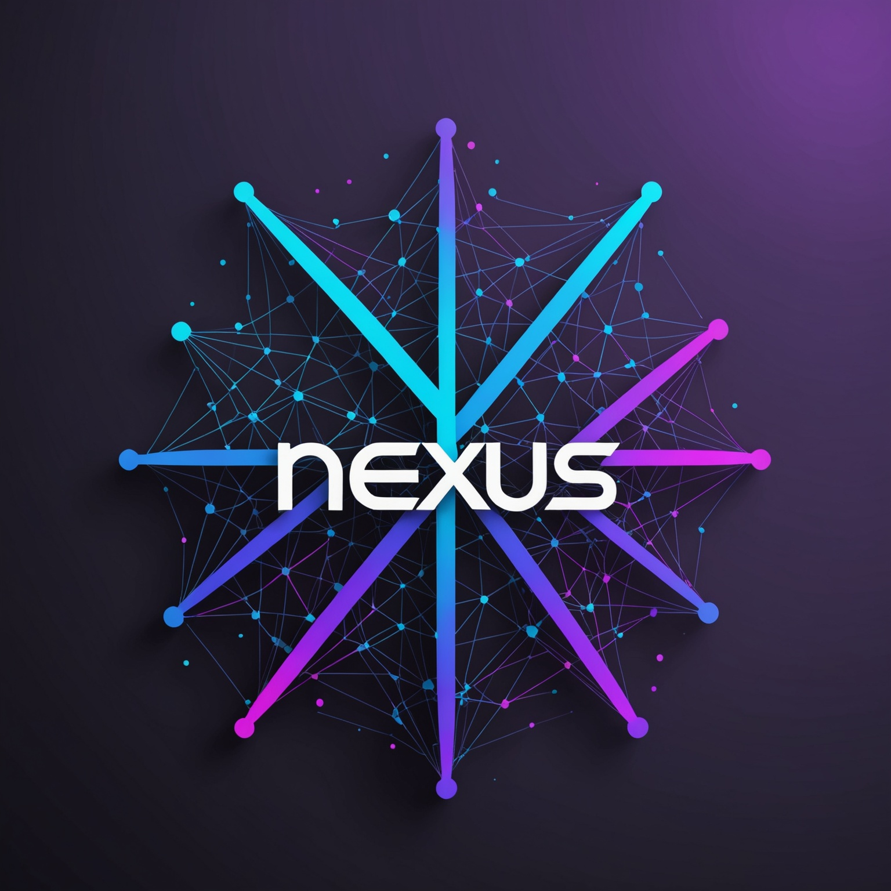
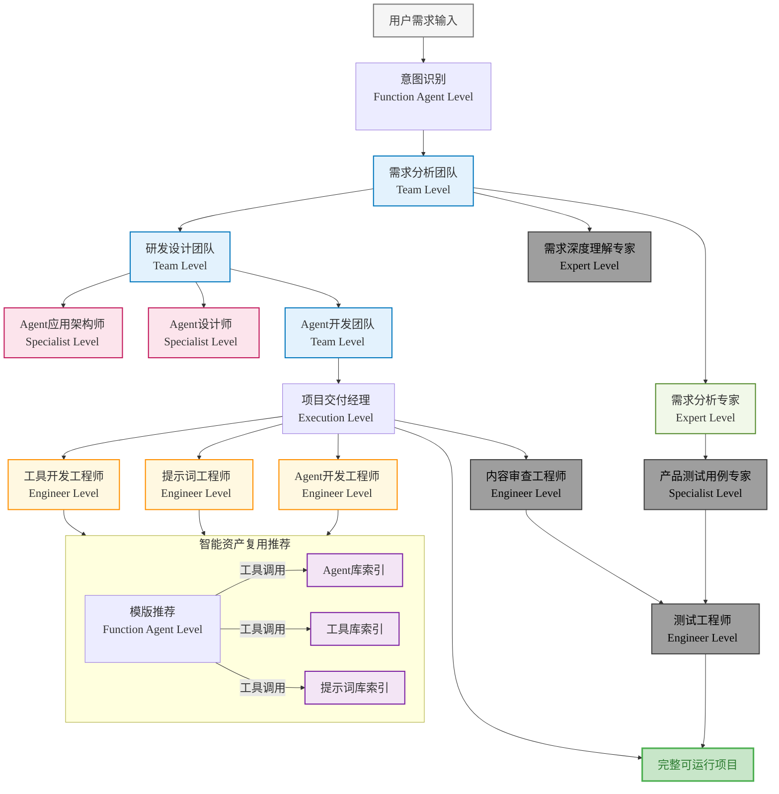

# Nexus-AI

<div align="center">




**Agentic AI-Native Platform - 从想法到实现，只需要一句话**

[](https://python.org)
[](https://aws.amazon.com/bedrock/)
[](https://strands.ai)
[](LICENSE)

[快速开始](#快速开始) • [功能特性](#功能特性) • [架构设计](#架构设计) • [使用指南](#使用指南) • [贡献指南](#贡献指南)

</div>

## 🌟 项目概述

Nexus-AI 是一个基于 AWS Bedrock 构建的开源企业级 AI 代理开发平台，通过"Agent Build Agent"的创新方法和自举式进化能力，让企业业务人员能够通过自然语言快速构建、部署和管理复杂的 AI 代理系统。

### 🎯 核心价值

- **🚀 极速构建**：从需求到部署，传统开发需要2-6个月，Nexus-AI仅需2-5天
- **🎨 零代码门槛**：业务人员无需编程知识，通过自然语言描述即可构建AI代理
- **🔄 自举式进化**：系统能够自我优化和迭代，持续提升能力
- **🏗️ 企业级架构**：基于AWS Bedrock，支持大规模生产环境部署

## 🏗️ 核心架构

### 单Agent构建工作流

Nexus-AI 采用分层架构设计，包含7个核心模块：



### 当前实现状态

| 模块 | 状态 | 描述 |
|------|------|------|
| **Agent Build** | ✅ 已完成 | 多Agent协作构建系统，支持7阶段自动化开发流程 |
| **会话模块** | 🔄 开发中 | 基于Streamlit的Web Demo界面，后续会进行重构 |
| **Agent Management** | 🔄 开发中 | Agent生命周期管理，包括版本控制和更新 |
| **Tools & MCP** | 🔄 开发中 | 工具库管理和MCP协议支持 |
| **Debug & Troubleshooting** | 📋 规划中 | 智能问题诊断和自动修复 |
| **Operations Management** | 📋 规划中 | 运维监控和自动化管理 |
| **Observability** | 📋 规划中 | 系统可观测性和性能分析 |

## 🚀 功能特性

### 🤖 智能代理构建

- **多Agent协作**：8个专业Agent协同工作，从需求分析到代码生成
- **自然语言驱动**：通过自然语言描述自动生成完整的AI代理系统
- **模板化开发**：内置多种Agent模板，支持单Agent和多Agent场景
- **智能资产复用**：自动识别和复用现有Agent、工具和提示词

### 🎯 已构建的Agent示例

Nexus-AI 已经成功构建了多个实用的AI代理，展示了平台的强大能力：

#### 📊 AWS相关Agent

**AWS架构生成器 (aws_architecture_generator)**
- 将自然语言描述转换为专业的AWS架构图
- 支持IT技术栈映射、架构验证

**AWS网络分析器 (aws_network_analyzer)**
- 自动化采集AWS网络资源配置信息
- 生成网络架构拓扑图
- 支持合规性评估和多格式输出

**AWS定价代理 (aws_pricing_agent)**
- 根据资源需求提供AWS服务配置推荐
- 支持EC2、EBS、S3、RDS等多种AWS服务

#### 📝 文档处理Agent

**HTML转PPT代理 (html2pptx)**
- 将HTML文档转换为PPTX演示文稿
- 保留原始样式、支持自定义模板

**PDF内容提取代理 (pdf_content_extractor)**
- 从PDF文件中提取文本内容
- 支持多模态处理和批量处理

**PPT转Markdown代理 (ppt_to_markdown)**
- 将PPT文件转换为Markdown格式
- 保持结构层次

**文件摘要代理 (file_summary_agent)**
- 支持多种文件格式摘要生成
- 支持批量处理和关键词提取

#### 🔍 检索与分析Agent

**新闻检索代理 (news_retrieval_agent)**
- 基于用户关注话题检索热门新闻
- 多平台聚合、智能摘要生成

**公司信息搜索代理 (company_info_search_agent)**
- 读取Excel表格中的公司信息
- 通过多种搜索引擎查询公司详细信息
- 支持批量处理和结果输出

#### 🎨 内容生成Agent

**Logo设计代理 (logo_design_agent)**
- 分析用户需求并生成logo设计
- 生成高质量logo图像和设计说明报告

**武侠小说生成器 (wuxia_novel_generator)**
- 根据设定生成符合武侠风格的小说
- 维护世界观一致性和情节连贯性

#### 🔬 医学相关Agent

**PubMed文献工作流**
- **检索代理**：检索和分析医学文献
- **编写助手**：生成文献综述，支持断点续传
- **筛选助手**：批量文献检索、分析和标记
- **审核助手**：评估文献质量，提供修改建议
- **主编助手**：模拟期刊主编视角进行评审
- **优化工作流**：整合编写、审核、主编流程

**临床医学专家 (clinical_medicine_expert_agent)**
- 回答临床医学和生命科学领域问题
- 提供基于证据的专业回答

**临床试验检索代理 (clinicaltrials_search_agent)**
- 智能检索ClinicalTrials.gov数据
- 从临床开发角度分析和呈现结果

**疾病HPO映射代理 (disease_hpo_mapping_agent)**
- 从医生主诉中提取疾病名称
- 关联到HPO ID

**医学文档翻译代理 (medical_document_translation_agent)**
- 精准翻译医学专业文档
- 支持医学词库管理和质量控制

### 🏗️ 企业级架构

- **AWS Bedrock 集成**：基于AWS Bedrock的强大AI能力
- **MCP 协议支持**：标准化的模型上下文协议
- **模块化设计**：可扩展的插件化架构
- **容器化部署**：支持Docker和AWS ECS部署

### 🔄 自举式进化

- **自我优化**：系统能够分析自身代码并持续改进
- **智能迭代**：基于用户反馈自动生成改进方案
- **安全更新**：所有自我更新都经过安全验证
- **渐进式进化**：采用小步快跑的方式进行自我改进

## 📁 项目结构

```
Nexus-AI/
├── agents/                          # 智能体实现
│   ├── system_agents/               # 核心平台智能体
│   │   └── agent_build_workflow/    # Agent构建工作流
│   ├── template_agents/             # 可复用智能体模板
│   └── generated_agents/            # 动态创建的智能体
├── tools/                           # 工具实现
│   ├── system_tools/                # 核心平台工具
│   ├── template_tools/              # 工具模板
│   └── generated_tools/             # 生成的工具
├── prompts/                         # YAML提示词模板
│   ├── system_agents_prompts/       # 系统智能体提示词
│   ├── template_prompts/            # 模板提示词
│   └── generated_agents_prompts/    # 生成的提示词
├── projects/                        # 用户项目目录
│   └── {project_name}/              # 具体项目
│       ├── agents/                  # Agent开发过程文件
│       ├── config.yaml              # 项目配置
│       ├── status.yaml              # 项目状态
│       └── README.md                # 项目说明
├── web/                             # Web前端界面
│   ├── components/                  # React组件
│   ├── pages/                       # 页面组件
│   ├── services/                    # 服务层
│   └── streamlit_app.py             # Streamlit应用入口
├── utils/                           # 共享工具
├── config/                          # 配置文件
├── mcp/                             # MCP服务器配置
└── docs/                            # 文档
```

## 🛠️ 技术栈

### 后端技术栈
- **Agent开发框架**: AWS Bedrock, Strands SDK
- **开发语言**: Python 3.12+

## 🚀 快速开始

### 1. 拉取代码并进入项目目录
```bash
git clone https://github.com/hy714335634/Nexus-AI.git
cd Nexus-AI
```

### 2. 初始化 Python 环境
```bash
python3.11 -m venv .nexus-ai
source .nexus-ai/bin/activate
echo 'source $HOME/Nexus-AI/.nexus-ai/bin/activate' >> ~/.bashrc
echo 'cd $HOME/Nexus-AI/' >> ~/.bashrc
source ~/.bashrc
python --version  # 应显示 3.11.x
```

> 如需保持 Python 3.12+，也可在本地环境直接创建 `.venv` 并激活。

### 3. 安装依赖
```bash
uv pip install --upgrade pip
uv pip install -r requirements.txt
uv pip list | head
```
> 国内网络环境可追加 `--index-url https://pypi.tuna.tsinghua.edu.cn/simple`

### 4. 配置 AWS 凭证
```bash
aws configure
```

### 5. 启动 Web 界面（可选）
```bash
cd web
streamlit run streamlit_app.py
```

### 首次使用

1. 打开浏览器访问 `http://localhost:8501`
2. 在首页输入你的需求描述
3. 点击"开始构建"按钮
4. 观察实时构建进度
5. 构建完成后测试你的Agent

## 🔍 功能与构建验证

- 环境验证示例：`python agents/system_agents/magician.py  -i "aws美东一的m8g.xlarge什么价格"`
- 长任务可采用 `nohup python -u agents/system_agents/agent_build_workflow/agent_build_workflow.py -i "<你的需求>" | tee logs/temp.log &`
- 查看实时日志：`tail -f nohup.out`
- 已生成项目位于 `projects/<project_name>/`，包含 `agents/`、`project_config.json`、`workflow_summary_report.md` 等产物

## 📖 使用指南
### 示例：构建HTML转PPT Agent

```python
# 1. 需求描述
需求 = """
请创建一个能够将HTML文档转换为pptx文档的Agent, 基本功能要求如下:
- 能够基于语义提取和识别关键和非关键信息，并思考PPT内容和故事主线
- PPT中出现的文字、段落内容应与HTML中内容一致
- 能够支持任意标签结构层级的HTML文档，能根据HTML标签结构定义PPT的结构
- 能够支持任意HTML标签的样式，能根据HTML标签样式定义PPT的样式
- PPT内容风格、模版样式应尽可能保持HTML原样式
- 对于HTML中图片内容，能尽可能保留，并以合理的布局展示在PPT中
- 能够使用用户指定的PPT模版
- 必要的文字内容和备注信息应尽可能保留，并存储在指定PPT页的备注中

**注意事项**
- 为避免Token超出限制,请避免使用base64编码方式进行输出
- PPT内容可分页输出
- 当通过模型解析到必要数据后,可缓存在本地.cache目录中,后续工具执行可通过传递缓存文件路径进行处理，避免token过长问题
"""

# 2. 系统自动执行构建流程
# 3. 生成完整的Agent系统
```

## 🔧 配置说明

### 基础配置

```yaml
# config/default_config.yaml
default-config:
  aws:
    bedrock_region_name: 'us-west-2'  # Amazon Bedrock API调用区域
    aws_region_name: 'us-west-2'      # 其他AWS服务的默认区域
    aws_profile_name: 'default'       # AWS配置文件名称
    verify: True                      # 验证SSL证书
  
  strands:
    template:
      agent_template_path: 'agents/template_agents'     # Agent模板路径
      prompt_template_path: 'prompts/template_prompts'  # 提示词模板路径
      tool_template_path: 'tools/template_tools'        # 工具模板路径
    generated:
      agent_generated_path: 'agents/generated_agents'   # 生成的Agent路径
      prompt_generated_path: 'prompts/generated_agents_prompts'
      tool_generated_path: 'tools/generated_tools'
    default_tools:
      - 'calculator'    # 计算器工具
      - 'shell'         # Shell命令工具
      - 'file_read'     # 文件读取工具
      - 'file_write'    # 文件写入工具
  
  agentcore:
    execution_role_prefix: 'agentcore'     # IAM执行角色前缀
    ecr_auto_create: True                  # 自动创建ECR仓库
    runtime_timeout_minutes: 30            # Agent运行时超时时间
  
  bedrock:
    model_id: 'us.anthropic.claude-3-7-sonnet-20250219-v1:0'    # 默认模型
    lite_model_id: 'us.anthropic.claude-3-5-haiku-20241022-v1:0' # 轻量模型
    pro_model_id: 'us.anthropic.claude-opus-4-20250514-v1:0'     # 专业模型
  
  logging:
    level: 'INFO'                          # 日志级别
    file_path: 'logs/nexus_ai.log'         # 日志文件路径
```

### MCP服务器配置

```json
// mcp/system_mcp_server.json
{
  "mcpServers": {
    "awslabs.core-mcp-server": {
      "command": "uvx",
      "args": ["awslabs.core-mcp-server@latest"],
      "env": {
        "FASTMCP_LOG_LEVEL": "ERROR"
      },
      "disabled": false
    },
    "awslabs.aws-pricing-mcp-server": {
      "command": "uvx", 
      "args": ["awslabs.aws-pricing-mcp-server@latest"],
      "env": {
        "FASTMCP_LOG_LEVEL": "ERROR",
        "AWS_PROFILE": "default",
        "AWS_REGION": "us-east-1"
      },
      "disabled": false
    },
    "awslabs.aws-api-mcp-server": {
      "command": "uvx",
      "args": ["awslabs.aws-api-mcp-server@latest"],
      "env": {
        "FASTMCP_LOG_LEVEL": "ERROR",
        "AWS_PROFILE": "default", 
        "AWS_REGION": "us-west-2"
      },
      "disabled": false
    }
  }
}
```

### 多模态处理配置

```yaml
# config/default_config.yaml (多模态部分)
multimodal_parser:
  aws:
    s3_bucket: "awesome-nexus-ai-file-storage"  # S3存储桶
    s3_prefix: "multimodal-content/"            # S3前缀
    bedrock_region: "us-west-2"                 # Bedrock区域
  
  file_limits:
    max_file_size: "50MB"                       # 最大文件大小
    max_files_per_request: 10                   # 每次请求最大文件数
    supported_formats: ["jpg", "jpeg", "png", "gif", "txt", "xlsx", "docx", "csv"]
  
  processing:
    timeout_seconds: 300                        # 处理超时时间
    retry_attempts: 3                          # 重试次数
    batch_size: 5                              # 批处理大小
  
  model:
    primary_model: "us.anthropic.claude-opus-4-20250514-v1:0"    # 主模型
    fallback_model: "us.anthropic.claude-3-7-sonnet-20250219-v1:0" # 备用模型
    max_tokens: 40000                          # 最大Token数
```

## 🎯 路线图

### 2025 Q4
- [ ] 完成单/多Agent Build模块
- [ ] 完成单Agent功能迭代模块
- [ ] 构建CICD工作流，自动化部署至AWS Bedrock AgentCore
- [ ] 优化Web界面用户体验

## 🤝 贡献指南

我们欢迎所有形式的贡献！

### 贡献方式

1. **报告问题**: 在GitHub Issues中报告bug或提出功能请求
2. **提交代码**: Fork项目并提交Pull Request
3. **完善文档**: 改进文档和示例
4. **分享经验**: 在Discussions中分享使用经验

---

<div align="center">

**让AI帮你构建AI，开启智能代理开发的新时代**

[](https://github.com/hy714335634/nexus-ai)
[](https://github.com/hy714335634/nexus-ai/fork)
[](https://github.com/hy714335634/nexus-ai)

</div>