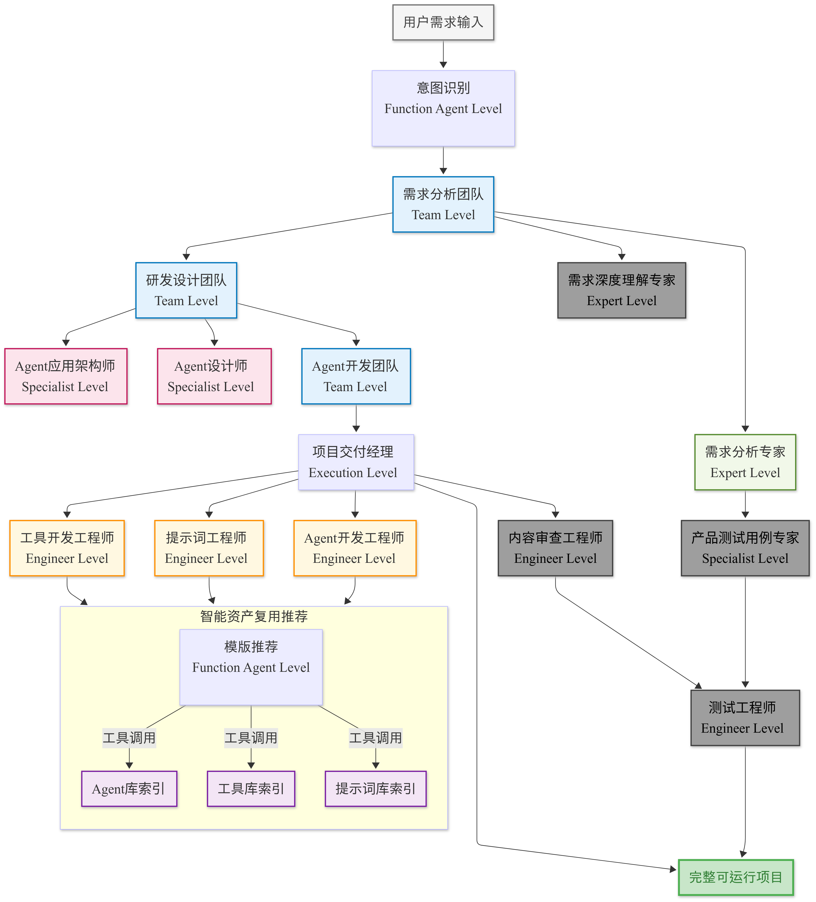

# Nexus-AI

<div align="center">


**Build AI Agents with Natural Language | 用自然语言构建 AI Agent**

[](https://python.org)
[](https://aws.amazon.com/bedrock/)
[](https://strandsagents.com/)
[](LICENSE)

[English](README_EN.md) | [中文](README.md)

[🚀 快速开始](#-快速开始) • [📖 详细安装](#-详细安装指南) • [🎯 示例](#-agent-示例) • [🤝 贡献](#-贡献指南)

</div>

---

## ✨ 什么是 Nexus-AI？

Nexus-AI 是一个开源的 **AI Agent 开发平台**，让你通过自然语言描述就能自动生成完整的 AI Agent 系统。

```
💬 "创建一个能分析股票并生成投资报告的 Agent"
     ↓
🤖 Nexus-AI 自动生成完整的 Agent 代码、工具和提示词
     ↓
✅ 可直接运行的股票分析 Agent
```

### 🎯 核心特性

| 特性 | 描述 |
|------|------|
| **🗣️ 自然语言构建** | 用中文或英文描述需求，自动生成 Agent |
| **🔄 Agent Build Agent** | 8个专业 Agent 协作，自动完成需求分析→架构设计→代码生成 |
| **⚡ 快速交付** | 传统开发 2-6 个月，Nexus-AI 仅需 2-5 天 |
| **🧩 模块化设计** | 工具、提示词、Agent 可复用和组合 |
| **☁️ AWS 原生** | 基于 AWS Bedrock，支持 Claude 系列模型 |

---

## 🚀 快速开始

### 方式一：一键安装（Amazon Linux 2023）

```bash
# 下载并执行安装脚本
curl -O https://raw.githubusercontent.com/hy714335634/Nexus-AI/main/setup_env_alinux2023.sh
chmod +x setup_env_alinux2023.sh
./setup_env_alinux2023.sh
```

> 脚本会自动安装所有依赖、克隆代码、配置环境

### 方式二：手动安装（通用）

```bash
# 1. 克隆项目
git clone https://github.com/hy714335634/Nexus-AI.git
cd Nexus-AI

# 2. 创建虚拟环境
python3.12 -m venv .venv
source .venv/bin/activate

# 3. 安装依赖
pip install -r requirements.txt
pip install -e .

# 4. 配置 AWS 凭证
aws configure
```

### 验证安装

```bash
# 测试环境是否正常
python agents/system_agents/magician.py -i "AWS us-east-1 的 m8g.xlarge 实例价格是多少？"
```

### 构建你的第一个 Agent

```bash
# 用自然语言描述你想要的 Agent
python agents/system_agents/agent_build_workflow/agent_build_workflow.py \
  -i "创建一个能够分析 PDF 文档并提取关键信息的 Agent"
```

> 💡 构建过程会自动生成完整的 Agent 代码到 `agents/generated_agents/` 目录

---

## 📖 详细安装指南

### 前置条件

| 组件 | 要求 |
|------|------|
| **操作系统** | Amazon Linux 2023 / Ubuntu 22.04+ / macOS |
| **Python** | 3.12+ |
| **Node.js** | 18+ (前端开发需要) |
| **AWS 账户** | 已开通 Bedrock 访问权限 |
| **推荐配置** | EC2 m8i.large 或更高 |

### 第一步：安装系统依赖

<details>
<summary>Amazon Linux 2023</summary>

```bash
# 安装基础工具
sudo dnf install -y git wget htop unzip tar gcc gcc-c++ make

# 安装 Python 3.12
sudo dnf install -y python3.12 python3.12-pip python3.12-devel

# 安装 Node.js
sudo dnf install -y nodejs npm

# 安装 Docker
sudo dnf install -y docker
sudo systemctl enable docker
sudo systemctl start docker
sudo usermod -aG docker $USER
newgrp docker
```

</details>

<details>
<summary>Ubuntu / Debian</summary>

```bash
# 安装基础工具
sudo apt update
sudo apt install -y git wget htop unzip build-essential

# 安装 Python 3.12
sudo add-apt-repository ppa:deadsnakes/ppa
sudo apt install -y python3.12 python3.12-venv python3.12-dev

# 安装 Node.js
curl -fsSL https://deb.nodesource.com/setup_18.x | sudo -E bash -
sudo apt install -y nodejs

# 安装 Docker
sudo apt install -y docker.io
sudo systemctl enable docker
sudo usermod -aG docker $USER
```

</details>

<details>
<summary>macOS</summary>

```bash
# 使用 Homebrew 安装
brew install python@3.12 node git

# 安装 Docker Desktop
# 从 https://www.docker.com/products/docker-desktop 下载安装
```

</details>

### 第二步：安装 uv（推荐的 Python 包管理器）

```bash
curl -LsSf https://astral.sh/uv/install.sh | sh
echo 'export PATH="$HOME/.local/bin:$PATH"' >> ~/.bashrc
source ~/.bashrc

# 验证安装
uv --version
```

### 第三步：克隆并配置项目

```bash
# 克隆代码
git clone https://github.com/hy714335634/Nexus-AI.git
cd Nexus-AI

# 创建虚拟环境
uv venv --python python3.12
source .venv/bin/activate

# 安装依赖
uv pip install --upgrade pip
uv pip install -r requirements.txt
uv pip install strands-agents[otel]
uv pip install -e .
```

### 第四步：配置 AWS 凭证

```bash
aws configure
# 输入:
# - AWS Access Key ID
# - AWS Secret Access Key
# - Default region: us-west-2 (推荐)
# - Output format: json

# 验证配置
aws sts get-caller-identity
```

### 第五步：初始化数据库（可选，Web 界面需要）

```bash
python api/scripts/setup_tables.py
```

### 第六步：启动服务

```bash
# 启动 Jaeger（可观测性，可选）
docker run -d --name jaeger \
  -p 16686:16686 -p 4317:4317 -p 4318:4318 \
  jaegertracing/all-in-one:latest

# 启动后端 API
nohup uvicorn api.main:app --host 0.0.0.0 --port 8000 --reload &

# 启动前端（新终端）
cd web && npm install && npm run dev -- -H 0.0.0.0
```

### 服务访问地址

| 服务 | 地址 | 说明 |
|------|------|------|
| Web 前端 | `http://<IP>:3000` | Next.js 界面 |
| API 文档 | `http://<IP>:8000/docs` | Swagger UI |
| Jaeger UI | `http://<IP>:16686` | 链路追踪 |

> ⚠️ **安全组配置**：如使用 EC2，请确保开放 3000、8000、16686 端口

---

## 🏗️ 工作原理

Nexus-AI 使用 **多 Agent 协作** 的方式自动构建 Agent：

```
用户需求 → 需求分析 → 架构设计 → Agent设计 → 提示词工程 → 工具开发 → 代码生成 → 测试验证
           ↓          ↓          ↓           ↓           ↓          ↓          ↓
        需求分析师   架构师    Agent设计师  提示词工程师  工具开发者  代码开发者  测试工程师
```

<details>
<summary>📊 查看详细架构图</summary>



</details>

---

## 🎯 Agent 示例

Nexus-AI 已成功构建的 Agent：

| 类别 | Agent | 功能 |
|------|-------|------|
| **AWS** | aws_pricing_agent | AWS 服务定价查询和配置推荐 |
| **AWS** | aws_architecture_diagram_generator | 自然语言生成 AWS 架构图 |
| **文档** | html_courseware_generator | 生成交互式 HTML 课件 |
| **文档** | pdf_content_extractor | PDF 内容提取和分析 |
| **分析** | stock_analysis_agent | 股票分析和投资报告生成 |
| **医疗** | clinicaltrials_search_agent | 临床试验数据智能搜索 |

<details>
<summary>📋 查看完整 Agent 列表（20+）</summary>

#### 🤖 平台助手
- **Nexus-AI-QA-Assistant** - 项目知识库问答服务，支持 FastAPI Web 接口

#### 📊 AWS 相关
- **aws_architecture_diagram_generator** - 自然语言转 AWS 架构图，支持 IT 技术栈映射
- **aws_network_topology_analyzer** - 网络拓扑分析和可视化，支持合规性评估
- **aws_pricing_agent** - AWS 服务定价查询，支持 EC2、EBS、S3、RDS 等

#### 📝 文档处理
- **html_courseware_generator** - 交互式 HTML 课件生成，支持数学公式、化学方程式
- **html2pptx** - HTML 转 PPT，保留原始样式
- **pdf_content_extractor** - PDF 内容提取，支持多模态处理
- **ppt_to_markdown** - PPT 转 Markdown，保持结构层次

#### 🔍 检索与分析
- **company_info_search_agent** - 企业信息搜索，支持批量处理
- **stock_analysis_agent** - 股票分析报告，基于 DCF 估值法

#### 🎨 内容生成
- **logo_design_agent** - Logo 设计，生成高质量图像和设计说明

#### 🔬 医学相关
- **medical_document_translation_agent** - 医学文档翻译，支持医学词库
- **openfda_data_agent** - FDA 数据查询，支持药物、医疗设备、食品
- **drug_feedback_collector** - 药物反馈收集，情感分析和主题分类
- **clinicaltrials_search_agent** - 临床试验搜索，面向临床开发专业人士
- **pubmed_literature_agent** - PubMed 文献检索和分析

</details>

---

## 📁 项目结构

```
Nexus-AI/
├── agents/                    # Agent 实现
│   ├── system_agents/         # 系统核心 Agent
│   │   └── agent_build_workflow/  # Agent 构建工作流（8个专业Agent）
│   ├── template_agents/       # Agent 模板
│   └── generated_agents/      # 生成的 Agent ⭐
├── tools/                     # 工具库
│   ├── system_tools/          # 系统工具
│   ├── template_tools/        # 工具模板
│   └── generated_tools/       # 生成的工具
├── prompts/                   # 提示词模板（YAML格式）
├── web/                       # Web 界面 (Next.js 14)
├── api/                       # FastAPI 后端
├── config/                    # 配置文件
├── projects/                  # 用户项目目录
└── docs/                      # 文档
```

---

## 🛠️ 技术栈

### 后端
- **语言**: Python 3.12+
- **AI 框架**: [Strands Agents](https://strandsagents.com/) + AWS Bedrock
- **模型**: Claude Sonnet 4.5, Claude Opus 4, Claude Haiku
- **Web 框架**: FastAPI + Uvicorn
- **数据库**: DynamoDB

### 前端
- **框架**: Next.js 14 (App Router)
- **UI**: React 18 + TypeScript
- **状态管理**: TanStack Query

### 基础设施
- **容器化**: Docker
- **IaC**: Terraform
- **可观测性**: OpenTelemetry + Jaeger
- **部署**: AWS ECS/EKS

---

## ⚙️ 配置说明

主配置文件：`config/default_config.yaml`

```yaml
default-config:
  aws:
    bedrock_region_name: 'us-west-2'
    aws_region_name: 'us-west-2'
  
  bedrock:
    model_id: 'us.anthropic.claude-sonnet-4-5-20250929-v1:0'      # 默认模型
    lite_model_id: 'us.anthropic.claude-3-5-haiku-20241022-v1:0'  # 轻量模型
    pro_model_id: 'us.anthropic.claude-opus-4-20250514-v1:0'      # 专业模型
  
  strands:
    generated:
      agent_generated_path: 'agents/generated_agents'
      prompt_generated_path: 'prompts/generated_agents_prompts'
      tool_generated_path: 'tools/generated_tools'
```

---

## 📖 文档

- [完整安装指南](docs/NEXUS_AI_SYSTEM_GUIDE.md)
- [API 使用示例](docs/API_USAGE_EXAMPLES.md)
- [Agent 构建模板](docs/VIBE_CODING_AGENT_BUILD_TEMPLATE.md)
- [部署指南](docs/DEPLOYMENT_READINESS_REPORT.md)

---

## 🗺️ 路线图

### 2025 Q4 ✅
- [x] 多 Agent 协作构建系统
- [x] 7 阶段自动化开发流程
- [x] Web 控制台界面
- [x] CI/CD 自动部署至 AWS Bedrock AgentCore

### 2026 Q1 🔄
- [ ] Agent 生命周期管理
- [ ] 工具库管理和 MCP 协议支持
- [ ] 智能问题诊断和自动修复

---

## 🤝 贡献指南

欢迎贡献！

1. Fork 本项目
2. 创建特性分支 (`git checkout -b feature/amazing-feature`)
3. 提交更改 (`git commit -m 'Add amazing feature'`)
4. 推送到分支 (`git push origin feature/amazing-feature`)
5. 提交 Pull Request

---

## 📄 许可证

本项目采用 MIT 许可证 - 查看 [LICENSE](LICENSE) 文件了解详情。

---

<div align="center">

**⭐ 如果这个项目对你有帮助，请给一个 Star！**

[](https://star-history.com/#hy714335634/Nexus-AI&Date)

Made with ❤️ by the Nexus-AI Team

</div>
