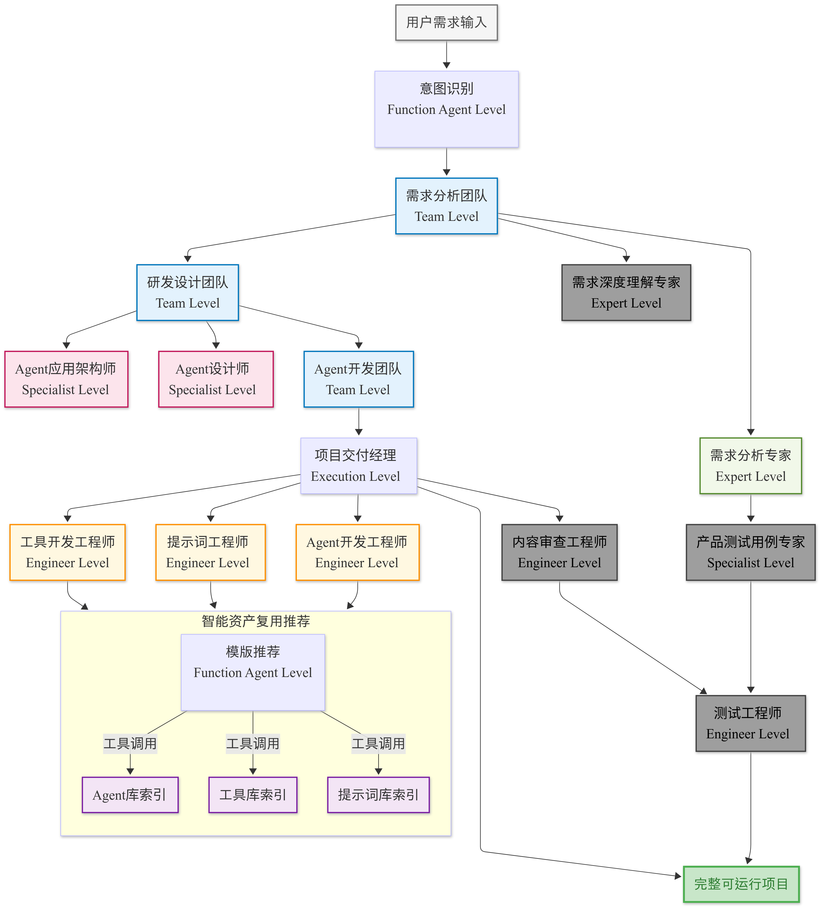

# Nexus-AI

<div align="center">


**Build AI Agents with Natural Language**

[](https://python.org)
[](https://aws.amazon.com/bedrock/)
[](https://strandsagents.com/)
[](LICENSE)

[English](README_EN.md) | [中文](README.md)

[🚀 Quick Start](#-quick-start) • [📖 Installation Guide](#-detailed-installation-guide) • [🎯 Examples](#-agent-examples) • [🤝 Contributing](#-contributing)

</div>

---

## 🎬 Demo Video

> 📺 [Watch Full Demo Video](https://duae5ywl7jger.cloudfront.net/demo.mp4)
>
> This video demonstrates Nexus-AI's core features: automatically building AI Agents from natural language descriptions

---

## ✨ What is Nexus-AI?

Nexus-AI is an open-source **AI Agent development platform** that automatically generates complete AI Agent systems from natural language descriptions.

```
💬 "Create an agent that analyzes stocks and generates investment reports"
     ↓
🤖 Nexus-AI automatically generates complete Agent code, tools, and prompts
     ↓
✅ Ready-to-run stock analysis Agent
```

### 🎯 Key Features

| Feature | Description |
|---------|-------------|
| **🗣️ Natural Language Building** | Describe requirements in plain English or Chinese, auto-generate Agents |
| **🔄 Agent Build Agent** | 8 specialized Agents collaborate: requirements → architecture → code |
| **⚡ Rapid Delivery** | Traditional dev: 2-6 months, Nexus-AI: few hours |
| **🧩 Modular Design** | Reusable and composable tools, prompts, and Agents |
| **☁️ AWS Native** | Built on AWS Bedrock, supports Claude model family |
| **🌐 Web Console** | Full-featured Web UI for Agent management, building, and chat |
| **📡 Async Task Queue** | SQS-based Worker architecture for long-running tasks |

---

## 🚀 Quick Start

### Option 1: One-Click Install (Amazon Linux 2023)

```bash
# Download and run the setup script
curl -O https://raw.githubusercontent.com/hy714335634/Nexus-AI/main/setup_env_alinux2023.sh
chmod +x setup_env_alinux2023.sh
./setup_env_alinux2023.sh
```

> The script automatically installs all dependencies, clones the code, and configures the environment

### Option 2: Manual Installation (Universal)

```bash
# 1. Clone the repository
git clone https://github.com/hy714335634/Nexus-AI.git
cd Nexus-AI

# 2. Create virtual environment
python3.12 -m venv .venv
source .venv/bin/activate

# 3. Install dependencies
pip install -r requirements.txt
pip install -e .

# 4. Configure AWS credentials
aws configure
```

### Verify Installation

```bash
# Test if environment is working
source .venv/bin/activate
python agents/system_agents/magician.py -i "What's the price of m8g.xlarge in AWS us-east-1?"
```

### Build Your First Agent

```bash
# Describe the Agent you want in natural language
source .venv/bin/activate
python agents/system_agents/agent_build_workflow/agent_build_workflow.py \
  -i "Create an agent that can analyze PDF documents and extract key information"
```

> 💡 The build process automatically generates complete Agent code to `agents/generated_agents/`

---

## 🖥️ Full Service Startup

Nexus-AI uses a microservices architecture with API service, Worker service, and Web frontend:

### 1. Initialize Infrastructure

```bash
cd Nexus-AI
source .venv/bin/activate

# Initialize DynamoDB tables and SQS queues
python scripts/init_infrastructure.py

# Or use CLI tool
./nexus-cli job init
```

### 2. Start Backend API

```bash
# Terminal 1
./scripts/start_api_v2.sh

# Or manually
source .venv/bin/activate
uvicorn api.v2.main:app --host 0.0.0.0 --port 8000 --reload
```

### 3. Start Worker Service

```bash
# Terminal 2
./scripts/start_worker.sh

# Or manually
source .venv/bin/activate
python worker/main.py
```

### 4. Start Web Frontend

```bash
# Terminal 3
cd web
npm install
npm run dev
```

### 5. Data Management (Optional)

```bash
# Clear all data (tables + queues)
./nexus-cli job clear

# Check job status
./nexus-cli job status
```

---

## 📖 Detailed Installation Guide

### Prerequisites

| Component | Requirement |
|-----------|-------------|
| **OS** | Amazon Linux 2023 / Ubuntu 22.04+ / macOS |
| **Python** | 3.13+ |
| **Node.js** | 18+ (for frontend development) |
| **AWS Account** | With Bedrock access enabled |
| **Recommended** | EC2 m8i.large or higher |

### Step 1: Install System Dependencies

<details>
<summary>Amazon Linux 2023</summary>

```bash
# Install basic tools
sudo dnf install -y git wget htop unzip tar gcc gcc-c++ make

# Install Python 3.13
sudo dnf install -y python3.13 python3.13-pip python3.13-devel

# Install Node.js
sudo dnf install -y nodejs npm

# Install Docker
sudo dnf install -y docker
sudo systemctl enable docker
sudo systemctl start docker
sudo usermod -aG docker $USER
newgrp docker
```

</details>

<details>
<summary>Ubuntu / Debian</summary>

```bash
# Install basic tools
sudo apt update
sudo apt install -y git wget htop unzip build-essential

# Install Python 3.13
sudo add-apt-repository ppa:deadsnakes/ppa
sudo apt install -y python3.13 python3.13-venv python3.13-dev

# Install Node.js
curl -fsSL https://deb.nodesource.com/setup_18.x | sudo -E bash -
sudo apt install -y nodejs

# Install Docker
sudo apt install -y docker.io
sudo systemctl enable docker
sudo usermod -aG docker $USER
```

</details>

<details>
<summary>macOS</summary>

```bash
# Install using Homebrew
brew install python@3.13 node git

# Install Docker Desktop
# Download from https://www.docker.com/products/docker-desktop
```

</details>

### Step 2: Install uv (Recommended Python Package Manager)

```bash
curl -LsSf https://astral.sh/uv/install.sh | sh
echo 'export PATH="$HOME/.local/bin:$PATH"' >> ~/.bashrc
source ~/.bashrc

# Verify installation
uv --version
```

### Step 3: Clone and Configure Project

```bash
# Clone repository
git clone https://github.com/hy714335634/Nexus-AI.git
cd Nexus-AI

# Create virtual environment
uv venv --python python3.13
source .venv/bin/activate

# Install dependencies
uv pip install --upgrade pip
uv pip install -r requirements.txt
uv pip install strands-agents[otel]
uv pip install -e .
```

### Step 4: Configure AWS Credentials

```bash
aws configure
# Enter:
# - AWS Access Key ID
# - AWS Secret Access Key
# - Default region: us-west-2 (recommended)
# - Output format: json

# Verify configuration
aws sts get-caller-identity
```

### Step 5: Initialize Infrastructure

```bash
# Initialize DynamoDB tables and SQS queues
python scripts/init_infrastructure.py

# Or use CLI
./nexus-cli job init
```

### Step 6: Start Services

```bash
# Start Jaeger (observability, optional)
docker run -d --name jaeger \
  -p 16686:16686 -p 4317:4317 -p 4318:4318 \
  jaegertracing/all-in-one:latest

# Start backend API (Terminal 1)
./scripts/start_api_v2.sh

# Start Worker service (Terminal 2)
./scripts/start_worker.sh

# Start frontend (Terminal 3)
cd web && npm install && npm run dev
```

### Service URLs

| Service | URL | Description |
|---------|-----|-------------|
| Web Frontend | `http://<IP>:3000` | Next.js interface |
| API Docs | `http://<IP>:8000/docs` | Swagger UI |
| Jaeger UI | `http://<IP>:16686` | Distributed tracing |

> ⚠️ **Security Group**: If using EC2, ensure ports 3000, 8000, 16686 are open

---

## 🏗️ How It Works

Nexus-AI uses **multi-agent collaboration** to automatically build Agents:

```
User Request → Requirements → Architecture → Agent Design → Prompt Engineering → Tool Dev → Code Gen → Testing
                  ↓              ↓              ↓                ↓                 ↓          ↓         ↓
              Analyst       Architect      Designer         Prompt Eng        Tool Dev    Code Dev   Tester
```

<details>
<summary>📊 View Detailed Architecture</summary>



</details>

---

## 🎯 Agent Examples

Agents successfully built with Nexus-AI:

| Category | Agent | Function |
|----------|-------|----------|
| **AWS** | aws_pricing_agent | AWS service pricing queries and config recommendations |
| **AWS** | aws_architecture_diagram_generator | Generate AWS architecture diagrams from natural language |
| **Docs** | html_courseware_generator | Generate interactive HTML courseware |
| **Docs** | pdf_content_extractor | PDF content extraction and analysis |
| **Analysis** | stock_analysis_agent | Stock analysis and investment report generation |
| **Medical** | clinicaltrials_search_agent | Intelligent clinical trial data search |

<details>
<summary>📋 View Full Agent List (20+)</summary>

#### 🤖 Platform Assistants
- **Nexus-AI-QA-Assistant** - Project knowledge base Q&A with FastAPI Web interface

#### 📊 AWS Related
- **aws_architecture_diagram_generator** - Natural language to AWS diagrams, IT stack mapping
- **aws_network_topology_analyzer** - Network topology analysis, compliance assessment
- **aws_pricing_agent** - AWS pricing queries for EC2, EBS, S3, RDS, etc.

#### 📝 Document Processing
- **html_courseware_generator** - Interactive HTML courseware, math formulas, chemistry equations
- **html2pptx** - HTML to PPT, preserves original styling
- **pdf_content_extractor** - PDF extraction, multimodal processing
- **ppt_to_markdown** - PPT to Markdown, maintains structure

#### 🔍 Search & Analysis
- **company_info_search_agent** - Company information search, batch processing
- **stock_analysis_agent** - Stock analysis reports, DCF valuation

#### 🎨 Content Generation
- **logo_design_agent** - Logo design, high-quality images and design specs

#### 🔬 Medical
- **medical_document_translation_agent** - Medical document translation, medical dictionary
- **openfda_data_agent** - FDA data queries for drugs, devices, food
- **drug_feedback_collector** - Drug feedback collection, sentiment analysis
- **clinicaltrials_search_agent** - Clinical trial search for clinical development professionals
- **pubmed_literature_agent** - PubMed literature search and analysis

</details>

---

## 📁 Project Structure

```
Nexus-AI/
├── agents/                    # Agent implementations
│   ├── system_agents/         # Core system Agents
│   │   ├── agent_build_workflow/  # Agent build workflow (8 specialized Agents)
│   │   ├── agent_update_workflow/ # Agent update workflow
│   │   ├── tool_build_workflow/   # Tool build workflow
│   │   └── magician.py        # Magician Agent (quick Q&A)
│   ├── template_agents/       # Agent templates
│   └── generated_agents/      # Generated Agents ⭐
├── tools/                     # Tool library
│   ├── system_tools/          # System tools
│   ├── template_tools/        # Tool templates
│   └── generated_tools/       # Generated tools
├── prompts/                   # Prompt templates (YAML format)
├── api/v2/                    # FastAPI backend API
│   ├── routers/               # API routes
│   ├── services/              # Business services
│   └── database/              # Database operations
├── worker/                    # Async task Worker
│   ├── handlers/              # Task handlers
│   └── main.py                # Worker entry point
├── web/                       # Web interface (Next.js 14)
├── nexus_utils/               # Core utilities
│   ├── cli/                   # CLI tools
│   └── multimodal_processing/ # Multimodal processing
├── infrastructure/            # Infrastructure code
│   ├── basic/                 # Terraform configs
│   └── docker/                # Docker configs
├── config/                    # Configuration files
├── scripts/                   # Startup scripts
├── projects/                  # User project directory
└── docs/                      # Documentation
```

---

## 🛠️ Tech Stack

### Backend
- **Language**: Python 3.13+
- **AI Framework**: [Strands Agents](https://strandsagents.com/) + AWS Bedrock
- **Models**: Claude Sonnet 4.5, Claude Opus 4, Claude Haiku
- **Web Framework**: FastAPI + Uvicorn
- **Database**: DynamoDB
- **Message Queue**: AWS SQS
- **Storage**: AWS S3

### Frontend
- **Framework**: Next.js 14 (App Router)
- **UI**: React 18 + TypeScript + Tailwind CSS
- **State Management**: TanStack Query

### Infrastructure
- **Containerization**: Docker
- **IaC**: Terraform
- **Observability**: OpenTelemetry + Jaeger
- **Deployment**: AWS ECS / EC2

---

## ⚙️ Configuration

Main config file: `config/default_config.yaml`

```yaml
default-config:
  aws:
    bedrock_region_name: 'us-west-2'
    aws_region_name: 'us-west-2'
  
  bedrock:
    model_id: 'us.anthropic.claude-sonnet-4-5-20250929-v1:0'      # Default model
    lite_model_id: 'us.anthropic.claude-3-5-haiku-20241022-v1:0'  # Lightweight model
    pro_model_id: 'us.anthropic.claude-opus-4-20250514-v1:0'      # Professional model
  
  strands:
    generated:
      agent_generated_path: 'agents/generated_agents'
      prompt_generated_path: 'prompts/generated_agents_prompts'
      tool_generated_path: 'tools/generated_tools'
```

---

## 📖 Documentation

- [Complete Installation Guide](docs/NEXUS_AI_SYSTEM_GUIDE.md)
- [API Usage Examples](docs/API_USAGE_EXAMPLES.md)
- [Agent Build Template](docs/VIBE_CODING_AGENT_BUILD_TEMPLATE.md)
- [Deployment Guide](docs/DEPLOYMENT_READINESS_REPORT.md)

---

## 🗺️ Roadmap

### 2025 Q4 ✅
- [x] Multi-Agent collaborative build system
- [x] 7-stage automated development workflow
- [x] Web console interface
- [x] Async task queue (SQS + Worker)
- [x] Real-time Agent build progress tracking

### 2026 Q1 🔄
- [x] API v2 refactoring (RESTful design)
- [x] CLI tool (nexus-cli)
- [ ] Agent lifecycle management
- [ ] Tool library management and MCP protocol support
- [ ] CI/CD auto-deployment to AWS Bedrock AgentCore

---

## 🤝 Contributing

Contributions are welcome!

1. Fork the repository
2. Create a feature branch (`git checkout -b feature/amazing-feature`)
3. Commit your changes (`git commit -m 'Add amazing feature'`)
4. Push to the branch (`git push origin feature/amazing-feature`)
5. Open a Pull Request

---

## 📄 License

This project is licensed under the MIT License - see the [LICENSE](LICENSE) file for details.

---

<div align="center">

**⭐ If this project helps you, please give it a Star!**

[](https://star-history.com/#hy714335634/Nexus-AI&Date)

Made with ❤️ by the Nexus-AI Team

</div>
