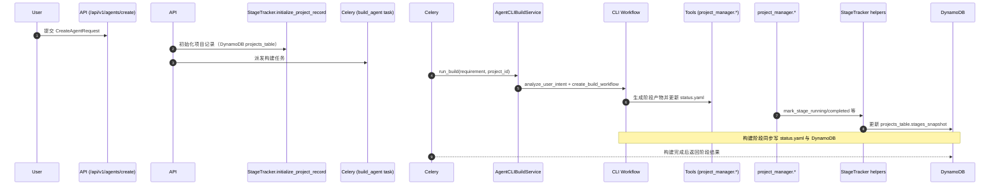

# Agent 构建与调用指南

## 1. 构建流程与 DynamoDB 交互

### 1.1 主要调用入口



### 1.2 关键模块

| 模块 | 作用 | 主要接口 |
|------|------|------------|
| `api/routers/agents.py` | 接收 REST 调用，封装 CreateAgentRequest、查询阶段 | `/agents/create`、`/agents/{task_id}/status`、`/agents/{project_id}/stages` |
| `api/services/stage_tracker.py` | 无状态阶段同步工具，写入 DynamoDB | `initialize_project_record`、`mark_stage_running`、`mark_stage_completed`、`mark_stage_failed`、`mark_project_completed` |
| `api/tasks/agent_build_tasks.py` | Celery 任务入口，执行 CLI workflow | `build_agent` |
| `agents/system_agents/agent_build_workflow/agent_build_workflow.py` | 旧 CLI workflow 实现 | `analyze_user_intent`、`create_build_workflow` |
| `tools/system_tools/agent_build_workflow/project_manager.py` | 构建过程中调用的工具方法 | `update_project_status`、`update_project_stage_content`、`get_project_status` 等 |
| `tools/system_tools/agent_build_workflow/stage_tracker.py` | 生成流程外部调用 DynamoDB 的 helper（生成器使用） | `mark_stage_running` 等 |
| DynamoDB `projects_table` | 存储项目阶段快照 | 字段：`project_id`、`stages_snapshot`、`progress_percentage`、`status` 等 |

### 1.3 流程详解

1. **创建项目记录**：
   - `initialize_project_record(project_id, requirement, user_id)` 将基础信息（需求、用户、阶段列表）写入 `projects_table`。
   - 初始 `stages_snapshot` 为 8 个阶段全部 `pending`。

2. **派发构建任务**：
   - API 返回 `task_id`（即 Celery 任务 ID，也是默认的 `project_id`）。
   - `build_agent` 将 orchestrator 阶段标记为 `running`，随后调用 CLI workflow。

3. **构建过程中的阶段更新**：
   - 生成器里的工具函数 `update_project_stage_content`、`update_project_status` 在每个阶段开始/结束时调用 `_sync_stage_progress`：
     - `status=False` ⇒ `mark_stage_running(project_id, stage)`
     - `status=True` ⇒ `mark_stage_completed(project_id, stage)`，若最后阶段再触发 `mark_project_completed`。
   - 每次调用都会更新 `projects_table.stages_snapshot`，包含 `started_at`、`completed_at`、`error` 信息。

4. **任务状态查询**：
   - `/agents/{task_id}/status` 调用 `AsyncResult` 查询 Celery 状态，同时读取 DynamoDB 最新阶段快照，合并返回。
   - `/agents/{project_id}/stages` 直接返回 `stages_snapshot` 的详细结构。

5. **元数据写入（待完善）**：
   - 当前构建流程尚未把生成的 Agent 注册到 `agents_table`。未来需要在构建完成后将 Agent 的路径、能力等元数据落库，以支持运行时调用。

## 2. 通过 API 调用生成的 Agent

### 2.1 统一的 Agent 脚本约定

生成的 Agent（例如 `agents/generated_agents/fitness_advisor/fitness_advisor_agent.py`）已被改造为具备以下接口：

- `get_agent()`：懒加载并返回 Strands Agent 实例。
- `invoke(message: str)`：最小化的对话入口，接受单轮文本消息。
- `get_agent_metadata()`：返回包含 `agent_id`、`entrypoint`、`capabilities` 等关键信息的字典。
- `create_workout_plan_for_user(...)` / `create_diet_plan_for_user(...)` 等业务函数。
- `main(argv)`：CLI 入口，支持 `chat`/`workout-plan`/`diet-plan` 子命令。

### 2.2 元数据登记建议

在构建任务的最后阶段，将 `get_agent_metadata()` 返回值写入 DynamoDB `agents_table`（或其他元数据存储），字段示例：

```json
{
  "agent_id": "fitness_advisor",
  "project_id": "job_xxx",
  "name": "Fitness Advisor Agent",
  "entrypoint": "agents.generated_agents.fitness_advisor.fitness_advisor_agent:invoke",
  "capabilities": ["chat", "workout_plan", "diet_plan"],
  "created_at": "2025-09-25T07:00:00Z"
}
```

这样 `/api/v1/agents` 可以返回完整 Agent 列表，后续运行时可以动态加载。

### 2.3 API 调用流程设计

1. **列出可用 Agent**：
   - `/agents` 查询 `agents_table`，返回 Agent ID、描述、能力等信息。

2. **创建会话**（可选）：
   - 设计 `/agents/{agent_id}/sessions` 接口，用于在服务端持久化会话状态。
   - 返回 `session_id`，后续对话基于此 ID 传递上下文。

3. **发送消息 / 调用功能**：
   - `/agents/{agent_id}/messages`：
     - 服务端读取 `entrypoint`。
     - 通过 `importlib` 加载模块并调用 `invoke(message, session_state)`；可将会话状态存储在缓存/数据库。
     - 返回 Agent 的文本回复。
   - 业务化接口示例：
     - `POST /agents/{agent_id}/workout-plan` ⇒ 调用 `create_workout_plan_for_user`。
     - `POST /agents/{agent_id}/diet-plan` ⇒ 调用 `create_diet_plan_for_user`。

4. **运行时服务封装**：
   - 建议写一个 `AgentRuntimeService`：
     ```python
     def load_agent(entrypoint: str):
         module_path, attr = entrypoint.split(":")
         module = importlib.import_module(module_path)
         return getattr(module, attr)
     ```
   - 统一管理实例缓存、会话状态、错误处理等。

5. **CLI 与 API 的一致性**：
   - CLI 命令：
     ```bash
     python agents/generated_agents/fitness_advisor/fitness_advisor_agent.py chat "给我一个每天 30 分钟的增肌计划"
     python agents/generated_agents/fitness_advisor/fitness_advisor_agent.py workout-plan Alice 增肌 中级 周一 周三 周五 哑铃 杠铃
     ```
   - API 调用：
     ```http
     POST /api/v1/agents/fitness_advisor/messages
     {"message": "给我一个每天 30 分钟的增肌计划"}
     ```
     或
     ```http
     POST /api/v1/agents/fitness_advisor/workout-plan
     {"name": "Alice", "goal": "增肌", "experience": "中级", "days": ["周一","周三","周五"], "equipment": ["哑铃","杠铃"]}
     ```
   - 两者都复用了 `fitness_advisor_agent.py` 内的核心函数，保证行为一致。

### 2.4 模板改造建议

为了让未来生成的 Agent 天生具备上述约定，需要同步升级生成模板：

1. **调整 Agent 代码模板**（`tools/system_tools/agent_build_workflow/agent_template_provider.py` 或对应 prompt 模板）：
   - 在骨架中加入 `get_agent()`、`invoke()`、`get_agent_metadata()`、`build_arg_parser()` 等函数。
   - CLI `main()` 只负责解析命令行，再调用这些函数；核心逻辑放在可被 API 重用的 Python 函数里。
   - 模板示例片段：
     ```python
     _AGENT_INSTANCE = None

     def get_agent():
         global _AGENT_INSTANCE
         if _AGENT_INSTANCE is None:
             _AGENT_INSTANCE = create_agent_from_prompt_template(...)
         return _AGENT_INSTANCE

     def invoke(message: str, *, session_state: Optional[Dict[str, Any]] = None) -> str:
         return get_agent()(message)

     def get_agent_metadata():
         return {
             "agent_id": "${agent_id}",
             "entrypoint": "${module_path}:invoke",
             "capabilities": ${capabilities}
         }
     ```

2. **在构建流程中写入 Agent 元数据**：
   - 在 `project_manager` 的最后阶段（或新的 service 层）调用 `get_agent_metadata()`，补充 `project_id`、生成时间等信息后，写入 DynamoDB `agents_table`。
   - 建议新增字段：`entrypoint`、`project_id`、`status`、`created_at`、`owner` 等。

3. **为模板预置业务函数**：
   - 根据项目需要，在模板中保留 hook（例如 `${custom_functions}`），让构建流程可以插入 `create_workout_plan` 这类业务逻辑。
   - 如果没有业务函数，则返回基础的 `invoke`/`chat` 能力。

4. **更新生成提示词**：
   - 在 `prompts/system_agents_prompts/agent_build_workflow/` 下的 YAML 中，描述新的代码约定，让生成器按模板输出标准骨架。

模板改造完成后，每次构建出来的 Agent 都会默认遵循统一接口，无需再手工修改脚本。

### 2.5 后续优化建议

- **会话状态管理**：为 `invoke` 增加 `session_state` 支持（例如维护历史消息、工具上下文）。
- **流式输出**：在 Strands Agent 支持下，提供 WebSocket/SSE 推送，供前端实时展示。
- **权限与限流**：在 API 层增加鉴权、速率限制，保护核心 Agent 资源。
- **日志与监控**：利用 `StrandsTelemetry` 采集的指标，将调用情况上报到集中监控系统。

---

通过以上约定，构建流程和运行流程都围绕统一的元数据和入口函数展开，无论是 CLI 还是 HTTP API，都能稳定复用同一份 Agent 实现。这样就不会出现“脚本难以对接 API”的问题，也方便未来扩展新能力。EOF
