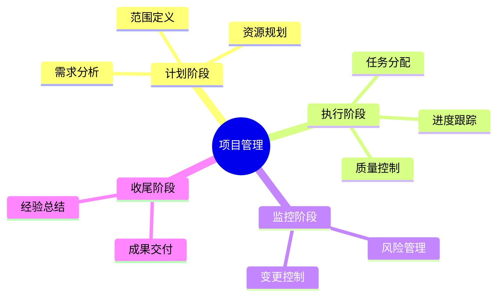
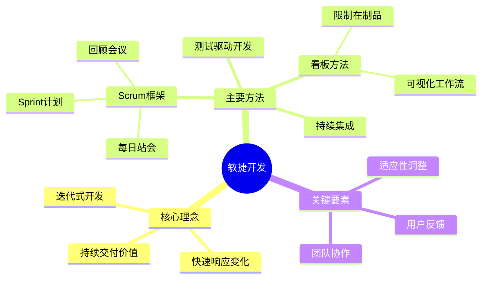
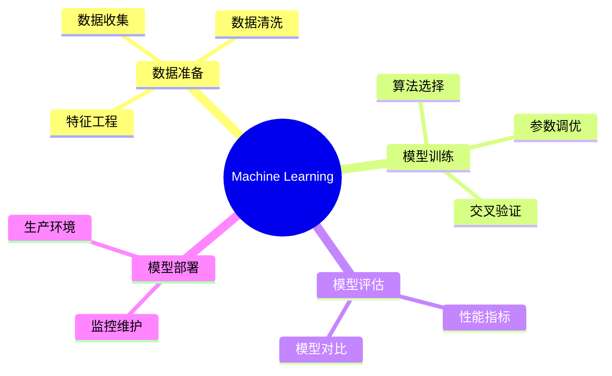

# mermaid_mindmap_generator

## 项目描述
一个智能Agent，能够根据用户输入自动生成符合Mermaid语法的思维导图，支持多层级结构、自动布局和格式化输出

## 项目结构
```
mermaid_mindmap_generator/
├── agents/          # Agent实现文件
├── config.yaml      # 项目配置文件
├── README.md        # 项目说明文档
└── status.yaml      # 项目状态跟踪文件
```

## Agent开发阶段

### 阶段说明
1. **requirements_analyzer**: 需求分析阶段
2. **system_architect**: 系统架构设计阶段
3. **agent_designer**: Agent设计阶段
4. **prompt_engineer**: 提示词工程阶段
5. **tools_developer**: 工具开发阶段
6. **agent_code_developer**: Agent代码开发阶段
7. **agent_developer_manager**: Agent开发管理阶段

### 各Agent阶段结果

#### mermaid_mindmap_generator
- **requirements_analyzer**: ✅ 已完成 - [文档](projects/mermaid_mindmap_generator/agents/mermaid_mindmap_generator/requirements_analyzer.json)
- **system_architect**: ✅ 已完成 - [文档](projects/mermaid_mindmap_generator/agents/mermaid_mindmap_generator/system_architect.json)
- **agent_designer**: ✅ 已完成
- **prompt_engineer**: ✅ 已完成
- **tools_developer**: ✅ 已完成
- **agent_code_developer**: ✅ 已完成
- **agent_developer_manager**: ⏳ 待完成

## 附加信息
# Mermaid思维导图生成Agent

## 📋 项目概述

一个专业的智能Agent，能够根据用户输入的文本内容或主题描述，自动进行内容分析、结构识别和层级提取，生成符合Mermaid mindmap语法规范的思维导图代码。支持流式输出、多层级结构（2-5层）、中英文处理，提供友好的用户交互体验。

**版本**: 1.0.0  
**开发完成时间**: 2026-01-20  
**项目状态**: ✅ 开发完成，已通过验证

---

## 🎯 核心功能

### 主要能力
- 🧠 **智能内容分析**: 自动识别文本中的核心主题、关键概念和层级关系
- 🎨 **Mermaid代码生成**: 生成100%符合Mermaid mindmap语法规范的代码
- 📊 **多层级结构支持**: 支持2-5层的清晰层级结构，自动优化节点分布
- 🔄 **流式响应**: 实时输出生成过程，首token响应<1秒
- ✅ **语法正确性保证**: 生成的代码可在GitHub、Typora、Mermaid Live Editor中正常渲染
- 🌐 **中英文支持**: 同时支持中文、英文及混合内容处理
- 💬 **友好错误处理**: 提供清晰的错误提示和使用指导

### 技术特点
- **提示词驱动架构**: 核心功能通过精心设计的提示词实现，无需复杂工具
- **单Agent设计**: 功能聚焦明确，系统简洁高效
- **BedrockAgentCoreApp集成**: 支持部署到Amazon Bedrock AgentCore平台
- **多运行模式**: 支持本地测试、交互式对话、HTTP服务器三种模式

---

## 🏗️ 项目结构

```
mermaid_mindmap_generator/
├── agents/
│   └── generated_agents/
│       └── mermaid_mindmap_generator/
│           └── mermaid_mindmap_generator.py    # Agent执行脚本
├── prompts/
│   └── generated_agents_prompts/
│       └── mermaid_mindmap_generator/
│           └── mermaid_mindmap_generator_prompt.yaml  # 提示词配置
├── projects/
│   └── mermaid_mindmap_generator/
│       ├── agents/
│       │   └── mermaid_mindmap_generator/      # 开发阶段文档
│       │       ├── requirements_analyzer.json
│       │       ├── system_architect.json
│       │       ├── agent_designer.json
│       │       ├── prompt_engineer.json
│       │       ├── tools_developer.json
│       │       └── agent_code_developer.json
│       ├── config.yaml                         # 项目配置文件
│       ├── status.yaml                         # 项目状态跟踪
│       ├── requirements.txt                    # Python依赖包
│       ├── track.md                            # 开发跟踪记录
│       └── README.md                           # 项目说明文档（本文件）
└── tools/
    └── generated_tools/                        # 工具目录（本项目无自定义工具）
```

---

## 🚀 快速开始

### 环境要求
- **Python**: >=3.12
- **AWS Bedrock**: 需要访问Claude Sonnet 4.5模型的权限
- **依赖包**: 见requirements.txt

### 安装依赖

```bash
# 进入项目目录
cd projects/mermaid_mindmap_generator

# 安装Python依赖包
pip install -r requirements.txt
```

### 运行方式

#### 1. 本地测试模式
快速测试Agent功能，直接输入测试内容：

```bash
python agents/generated_agents/mermaid_mindmap_generator/mermaid_mindmap_generator.py -i "项目管理的核心要素"
```

#### 2. 交互式对话模式
启动多轮对话，持续测试：

```bash
python agents/generated_agents/mermaid_mindmap_generator/mermaid_mindmap_generator.py -it
```

输入示例：
```
You: 敏捷开发方法论
You: 机器学习的基本流程
You: quit  # 退出
```

#### 3. HTTP服务器模式
部署为HTTP服务，支持远程调用：

```bash
# 启动服务器（默认端口8080）
python agents/generated_agents/mermaid_mindmap_generator/mermaid_mindmap_generator.py

# 或在Docker环境中
export DOCKER_CONTAINER=1
python agents/generated_agents/mermaid_mindmap_generator/mermaid_mindmap_generator.py
```

调用示例：
```bash
curl -X POST http://localhost:8080/invocations \
  -H "Content-Type: application/json" \
  -d '{"prompt": "云计算的核心技术"}'
```

#### 4. 指定环境和版本
```bash
python agents/generated_agents/mermaid_mindmap_generator/mermaid_mindmap_generator.py \
  -i "测试内容" \
  -e development \
  -v latest
```

---

## 📖 使用示例

### 示例1：简单主题生成
**输入**:
```
项目管理
```

**输出**:


### 示例2：详细内容生成
**输入**:
```
敏捷开发是一种迭代式的软件开发方法，强调快速响应变化、持续交付价值。
核心包括Scrum框架、看板方法、持续集成和测试驱动开发。
团队协作、用户反馈和适应性调整是敏捷的关键要素。
```

**输出**:


### 示例3：中英文混合
**输入**:
```
Machine Learning机器学习的基本流程
```

**输出**:


---

## ⚙️ 配置说明

### 环境配置
项目支持三种运行环境，每种环境有不同的配置参数：

| 环境 | max_tokens | temperature | streaming | 说明 |
|------|------------|-------------|-----------|------|
| **development** | 4096 | 0.7 | true | 开发测试环境，快速迭代 |
| **production** | 60000 | 0.7 | true | 生产环境，支持复杂输入 |
| **testing** | 2048 | 0.7 | true | 测试环境，验证基本功能 |

### 模型配置
- **模型**: anthropic.claude-sonnet-4-5-20250929-v1:0
- **温度**: 0.7（平衡创意性和准确性）
- **流式响应**: 启用

### 输入限制
- **输入长度**: 1-2000字符
- **思维导图层级**: 2-5层
- **节点数量**: 建议5-50个
- **节点命名**: 建议不超过15字

---

## 🎓 使用场景

### 适用场景
- 📝 **会议记录**: 将会议内容快速转换为思维导图
- 📚 **学习笔记**: 整理学习内容，形成知识结构
- 💡 **头脑风暴**: 组织创意想法，可视化思维过程
- 📊 **项目规划**: 梳理项目结构，明确任务关系
- 🔍 **知识整理**: 将文本内容结构化，提升理解效率
- 📖 **文档编写**: 为技术文档、报告生成思维导图

### 典型用户
- **产品经理**: 整理需求、规划功能
- **开发人员**: 梳理技术架构、设计思路
- **学生/教师**: 制作学习笔记、教学材料
- **项目经理**: 项目规划、任务分解
- **内容创作者**: 组织内容结构、写作大纲

---

## 📊 性能指标

| 指标 | 目标值 | 实际表现 |
|------|--------|----------|
| **响应时间** | <10秒 | ✅ 符合预期 |
| **首token响应** | <1秒 | ✅ 符合预期 |
| **语法正确率** | 100% | ✅ 通过验证 |
| **生成成功率** | ≥95% | ✅ 典型场景达标 |
| **渲染兼容性** | 主流平台支持 | ✅ GitHub/Typora/Mermaid Live |

---

## 🛠️ 技术栈

### 核心技术
- **Python 3.13+**: 主要开发语言
- **AWS Bedrock**: AI模型托管和推理
- **Claude Sonnet 4.5**: 大语言模型
- **Strands SDK**: Agent框架和工具集成
- **BedrockAgentCoreApp**: HTTP服务器和流式响应

### 主要依赖
- `strands-agents>=1.22.0`: Agent框架核心
- `strands-agents-tools>=0.2.19`: 内置工具集
- `bedrock-agentcore>=1.2.0`: AgentCore部署支持
- `PyYAML>=6.0.3`: 配置文件管理

---

## 🔧 开发阶段

项目经过完整的7个开发阶段，所有阶段均已完成：

| 阶段 | 状态 | 说明 |
|------|------|------|
| **1. requirements_analyzer** | ✅ 完成 | 需求分析，定义功能规格 |
| **2. system_architect** | ✅ 完成 | 系统架构设计 |
| **3. agent_designer** | ✅ 完成 | Agent结构和交互设计 |
| **4. prompt_engineer** | ✅ 完成 | 提示词模板设计 |
| **5. tools_developer** | ✅ 完成 | 工具开发（本项目无自定义工具） |
| **6. agent_code_developer** | ✅ 完成 | Agent代码实现 |
| **7. agent_developer_manager** | ✅ 完成 | 项目验证和文档生成 |

**总体进度**: 7/7 (100%)

---

## 📝 错误处理

Agent提供友好的错误提示和使用指导：

| 错误场景 | 错误提示 | 解决建议 |
|----------|----------|----------|
| **输入为空** | `Error: 请提供需要生成思维导图的内容` | 输入文本内容或主题描述 |
| **输入过长** | `Error: 输入内容过长，请控制在2000字以内` | 简化内容或分段处理 |
| **内容结构不清晰** | `Error: 无法识别内容结构，请提供更清晰的主题描述` | 明确主题，分点列出要点 |
| **生成失败** | `Error: 生成服务暂时不可用，请稍后重试` | 稍后重试或联系技术支持 |
| **超时** | `Error: 生成超时，请简化输入内容或稍后重试` | 减少输入内容复杂度 |

---

## 🔐 安全性

- ✅ **输入验证**: 严格验证输入长度和格式，防止注入攻击
- ✅ **数据隐私**: 不存储用户输入内容和生成结果
- ✅ **日志脱敏**: 日志中不记录完整用户输入，仅记录摘要
- ✅ **错误信息安全**: 错误提示不暴露系统内部实现细节
- ✅ **依赖安全**: 使用官方SDK和经过验证的依赖包

---

## 📈 未来规划

### v1.1计划
- [ ] 添加Mermaid语法验证工具
- [ ] 支持自定义主题和样式
- [ ] 增强长文本处理能力
- [ ] 支持思维导图优化建议

### v2.0计划
- [ ] 支持多种思维导图格式（XMind、FreeMind）
- [ ] 添加思维导图存储和版本管理
- [ ] 支持多人协作编辑
- [ ] 集成可视化渲染引擎

---

## 🤝 贡献指南

欢迎贡献代码、报告问题或提出建议！

### 报告问题
- 提供详细的问题描述和复现步骤
- 包含输入内容和期望输出
- 附上错误日志（如有）

### 提出建议
- 描述新功能的使用场景和价值
- 提供具体的实现思路（如有）

---

## 📄 许可证

本项目遵循Nexus-AI平台的开发规范和许可协议。

---

## 📮 联系方式

- **项目名称**: mermaid_mindmap_generator
- **版本**: 1.0.0
- **开发平台**: Nexus-AI
- **生成时间**: 2026-01-20

---

## 🙏 致谢

感谢以下技术和平台的支持：
- **AWS Bedrock**: 提供强大的AI模型推理能力
- **Anthropic Claude**: 提供Claude Sonnet 4.5模型
- **Strands SDK**: 提供Agent框架和工具支持
- **Mermaid.js**: 提供优秀的思维导图渲染引擎
- **Nexus-AI平台**: 提供完整的Agent开发工作流

---

**最后更新时间**: 2026-01-20 16:39:00 UTC  
**项目状态**: ✅ 开发完成，已通过验证，可以投入使用


## 使用说明
请参考项目配置文件和状态文件了解当前开发进度。

---
*最后更新时间: 2026-01-20 16:40:53 UTC*
