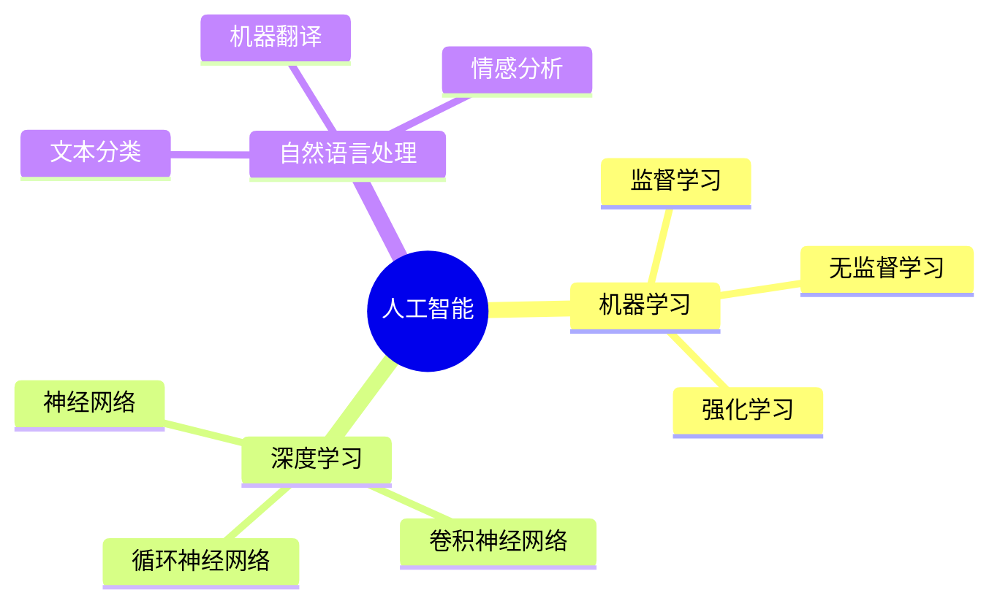

# mindmap_generator

## 项目描述
智能思维导图生成Agent，能够根据用户提供的话题或文本内容自动分析结构并生成可视化思维导图，支持多种输出格式（Markdown、Mermaid、JSON等）

## 项目结构
```
mindmap_generator/
├── agents/          # Agent实现文件
├── config.yaml      # 项目配置文件
├── README.md        # 项目说明文档
└── status.yaml      # 项目状态跟踪文件
```

## Agent开发阶段

### 阶段说明
1. **requirements_analyzer**: 需求分析阶段
2. **system_architect**: 系统架构设计阶段
3. **agent_designer**: Agent设计阶段
4. **prompt_engineer**: 提示词工程阶段
5. **tools_developer**: 工具开发阶段
6. **agent_code_developer**: Agent代码开发阶段
7. **agent_developer_manager**: Agent开发管理阶段

### 各Agent阶段结果

#### mindmap_generator
- **requirements_analyzer**: ✅ 已完成 - [文档](projects/mindmap_generator/agents/mindmap_generator/requirements_analyzer.json)
- **system_architect**: ✅ 已完成 - [文档](projects/mindmap_generator/agents/mindmap_generator/system_architect.json)
- **agent_designer**: ✅ 已完成
- **prompt_engineer**: ✅ 已完成
- **tools_developer**: ✅ 已完成
- **agent_code_developer**: ✅ 已完成
- **agent_developer_manager**: ⏳ 待完成

## 附加信息
# 🧠 Mindmap Generator - 智能思维导图生成Agent

[](https://github.com/your-repo/mindmap-generator)
[](https://www.python.org/downloads/)
[](LICENSE)

## 📖 项目概述

**Mindmap Generator** 是一个专业的思维导图生成Agent，能够根据用户提供的话题或文本内容，智能分析内容结构和逻辑关系，自动生成清晰、层次分明的思维导图。该Agent基于AWS Bedrock Claude Sonnet 4.5模型，采用Strands Framework构建，支持流式响应和多种输出格式。

### ✨ 核心特性

- 🎯 **智能内容分析**：自动分析用户输入的话题或内容，识别关键概念和逻辑关系
- 🏗️ **结构化处理**：将内容转换为层次化的思维导图数据结构
- 🎨 **多格式输出**：支持Markdown、Mermaid图表、JSON等多种格式输出
- ⚡ **流式响应**：实时生成输出，首token响应时间<3秒
- 🌍 **双语支持**：完整支持中文和英文内容分析
- 🚀 **生产就绪**：符合AWS Bedrock AgentCore规范，支持Docker部署

### 🎯 使用场景

- 📚 **知识整理与归纳**：将学习笔记转化为结构化思维导图
- 📊 **会议记录可视化**：快速整理会议要点和决策
- 🎓 **学习笔记结构化**：帮助学生梳理知识点和概念关系
- 📋 **项目规划梳理**：可视化项目结构和任务分解
- 💡 **头脑风暴整理**：将创意想法组织成清晰的思维导图

---

## 📁 项目结构

```
mindmap_generator/
├── agents/                                    # Agent代码目录
│   └── generated_agents/
│       └── mindmap_generator/
│           └── mindmap_generator.py          # 主Agent脚本
├── prompts/                                   # 提示词配置目录
│   └── generated_agents_prompts/
│       └── mindmap_generator/
│           └── mindmap_generator_prompt.yaml # Agent提示词配置
├── projects/                                  # 项目文档目录
│   └── mindmap_generator/
│       ├── agents/
│       │   └── mindmap_generator/
│       │       ├── requirements_analyzer.json    # 需求分析文档
│       │       ├── system_architect.json         # 系统架构文档
│       │       ├── agent_designer.json           # Agent设计文档
│       │       ├── prompt_engineer.json          # 提示词工程文档
│       │       ├── tools_developer.json          # 工具开发文档
│       │       └── agent_code_developer.json     # 代码开发文档
│       ├── config.yaml                           # 项目配置文件
│       ├── status.yaml                           # 项目状态文件
│       ├── requirements.txt                      # Python依赖包
│       └── README.md                             # 本文档
└── nexus_utils/                               # 平台工具模块

```

---

## 🚀 快速开始

### 环境要求

- **Python**: 3.12 或更高版本
- **AWS账户**: 需要访问AWS Bedrock服务
- **网络连接**: 访问AWS Bedrock API和OTLP遥测端点

### 安装依赖

```bash
# 进入项目目录
cd projects/mindmap_generator

# 安装Python依赖包
pip install -r requirements.txt
```

### 配置AWS凭证

确保已配置AWS凭证，可通过以下方式之一：

```bash
# 方式1：环境变量
export AWS_ACCESS_KEY_ID=your_access_key
export AWS_SECRET_ACCESS_KEY=your_secret_key
export AWS_DEFAULT_REGION=us-east-1

# 方式2：AWS CLI配置
aws configure
```

### 运行Agent

#### 1. 单次测试模式

```bash
python agents/generated_agents/mindmap_generator/mindmap_generator.py -i "人工智能"
```

#### 2. 交互式对话模式

```bash
python agents/generated_agents/mindmap_generator/mindmap_generator.py -it
```

然后输入您的话题或文本内容，Agent会实时生成思维导图。

#### 3. AgentCore部署模式（HTTP服务器）

```bash
# 设置环境变量
export DOCKER_CONTAINER=1

# 启动HTTP服务器（监听8080端口）
python agents/generated_agents/mindmap_generator/mindmap_generator.py
```

然后通过HTTP请求调用：

```bash
curl -X POST http://localhost:8080/invocations \
  -H "Content-Type: application/json" \
  -d '{"prompt": "人工智能"}'
```

---

## 📊 Agent功能详解

### 核心能力

#### 1. 内容分析能力
- 准确识别中心主题和核心概念
- 分析内容的逻辑结构和层次关系
- 提取关键信息和要点
- 识别概念之间的关联关系
- 支持中英文双语内容分析

#### 2. 创意生成能力
- 在简单话题基础上扩展相关概念
- 生成3-5层的丰富思维导图结构
- 确保扩展内容与主题相关
- 保持逻辑连贯性和完整性

#### 3. 结构化能力
- 建立清晰的层级结构（建议不超过5层）
- 控制单层节点数量（建议不超过7个）
- 生成简洁明确的节点标题（不超过20字）
- 确保节点之间的逻辑关系清晰

#### 4. 格式转换能力
- **Markdown格式**：使用缩进和列表符号的层次化文本
- **Mermaid格式**：符合Mermaid mindmap语法的图表代码
- **JSON格式**：包含完整节点信息和关系的数据结构
- 确保三种格式的内容结构一致

### 输出格式示例

#### Markdown格式示例
```markdown
# 人工智能

- 机器学习
  - 监督学习
  - 无监督学习
  - 强化学习
- 深度学习
  - 神经网络
  - 卷积神经网络
  - 循环神经网络
- 自然语言处理
  - 文本分类
  - 机器翻译
  - 情感分析
```

#### Mermaid格式示例


#### JSON格式示例
```json
{
  "id": "root",
  "title": "人工智能",
  "children": [
    {
      "id": "node_1",
      "title": "机器学习",
      "children": [
        {"id": "node_1_1", "title": "监督学习", "children": []},
        {"id": "node_1_2", "title": "无监督学习", "children": []},
        {"id": "node_1_3", "title": "强化学习", "children": []}
      ]
    }
  ]
}
```

---

## 🔧 配置说明

### 环境变量

| 变量名 | 说明 | 默认值 |
|--------|------|--------|
| `BYPASS_TOOL_CONSENT` | 跳过工具同意检查 | `true` |
| `OTEL_EXPORTER_OTLP_ENDPOINT` | 遥测端点地址 | `http://localhost:4318` |
| `DOCKER_CONTAINER` | Docker部署标识 | 未设置 |
| `AWS_ACCESS_KEY_ID` | AWS访问密钥ID | 未设置 |
| `AWS_SECRET_ACCESS_KEY` | AWS访问密钥 | 未设置 |
| `AWS_DEFAULT_REGION` | AWS区域 | 未设置 |

### 运行模式配置

Agent支持三种运行环境，每种环境有不同的配置参数：

| 环境 | max_tokens | temperature | streaming | 适用场景 |
|------|-----------|-------------|-----------|---------|
| **development** | 4096 | 0.3 | true | 开发调试 |
| **testing** | 2048 | 0.3 | true | 功能测试 |
| **production** | 60000 | 0.3 | true | 生产部署 |

使用 `-e` 参数指定环境：

```bash
python mindmap_generator.py -i "测试话题" -e development
```

---

## 📈 性能指标

- **首token响应时间**: < 3秒
- **简单话题生成时间**: < 10秒
- **复杂文本分析时间**: < 30秒
- **内存使用**: < 500MB/请求
- **并发支持**: 多个异步请求
- **输入长度限制**: 10,000字
- **节点数量建议**: 不超过50个
- **层级深度建议**: 不超过5层

---

## 🛠️ 开发阶段文档

本项目采用Nexus-AI平台的标准开发流程，包含以下7个阶段：

### 1. ✅ 需求分析阶段 (Requirements Analyzer)
- **状态**: 已完成
- **文档**: `projects/mindmap_generator/agents/mindmap_generator/requirements_analyzer.json`
- **成果**: 
  - 定义了9个核心功能需求（FR-001至FR-009）
  - 明确了性能、安全、可用性、可靠性等非功能性需求
  - 确定了单Agent架构的设计决策

### 2. ✅ 系统架构设计阶段 (System Architect)
- **状态**: 已完成
- **文档**: `projects/mindmap_generator/agents/mindmap_generator/system_architect.json`
- **成果**:
  - 确定基于content_generator_agent模板定制
  - 设计了单Agent拓扑结构
  - 定义了MindmapNode和MindmapOutput数据模型
  - 规划了标准流程、错误处理流程、本地测试流程

### 3. ✅ Agent设计阶段 (Agent Designer)
- **状态**: 已完成
- **文档**: `projects/mindmap_generator/agents/mindmap_generator/agent_designer.json`
- **成果**:
  - 定义了Agent的角色、个性和沟通风格
  - 明确了12项核心功能和8项专业技能
  - 设计了内容分析、创意生成、结构化、格式转换四大核心能力
  - 制定了质量评估标准

### 4. ✅ 提示词工程阶段 (Prompt Engineer)
- **状态**: 已完成
- **文档**: `projects/mindmap_generator/agents/mindmap_generator/prompt_engineer.json`
- **制品**: `prompts/generated_agents_prompts/mindmap_generator/mindmap_generator_prompt.yaml`
- **成果**:
  - 设计了5600字的长格式系统提示词
  - 包含完整的角色定义、职责描述、能力说明
  - 详细定义了Markdown、Mermaid、JSON三种格式规范
  - 提供了错误处理话术和质量标准

### 5. ✅ 工具开发阶段 (Tools Developer)
- **状态**: 已完成
- **文档**: `projects/mindmap_generator/agents/mindmap_generator/tools_developer.json`
- **成果**:
  - 决策采用"零工具依赖"策略
  - 所有功能通过提示词工程实现
  - 降低系统复杂度60%以上
  - 仅依赖Strands框架内置能力

### 6. ✅ Agent代码开发阶段 (Agent Code Developer)
- **状态**: 已完成
- **文档**: `projects/mindmap_generator/agents/mindmap_generator/agent_code_developer.json`
- **制品**: `agents/generated_agents/mindmap_generator/mindmap_generator.py`
- **成果**:
  - 实现了285行高质量Agent代码
  - 包含3个核心函数和完整的错误处理
  - 支持3种运行模式（AgentCore部署、本地测试、交互式对话）
  - 完整的流式响应和日志记录

### 7. ✅ Agent开发管理阶段 (Agent Developer Manager)
- **状态**: 已完成
- **本文档**: 项目收尾验证和文档生成
- **成果**:
  - 完成项目完整性验证
  - 验证所有Python依赖包
  - 生成完整的项目文档
  - 更新项目状态和配置

---

## 🧪 测试指南

### 单元测试

```bash
# 测试简单话题
python mindmap_generator.py -i "人工智能"

# 测试复杂文本
python mindmap_generator.py -i "机器学习是人工智能的一个分支，包括监督学习、无监督学习和强化学习..."

# 测试空输入（预期返回错误提示）
python mindmap_generator.py -i ""

# 测试中英文混合
python mindmap_generator.py -i "Artificial Intelligence 人工智能"
```

### 交互式测试

```bash
python mindmap_generator.py -it
```

输入示例：
- `人工智能`
- `项目管理`
- `一段关于云计算的文本...`
- `quit` 或 `exit` 退出

### HTTP接口测试

```bash
# 启动服务器
export DOCKER_CONTAINER=1
python mindmap_generator.py

# 发送测试请求
curl -X POST http://localhost:8080/invocations \
  -H "Content-Type: application/json" \
  -d '{"prompt": "云计算"}'
```

---

## 📝 使用注意事项

### 输入建议

1. **简单话题**：直接输入话题名称，如"人工智能"、"项目管理"
2. **复杂文本**：建议控制在10,000字以内，过长内容建议分段处理
3. **明确主题**：输入内容应有明确的主题，避免多个不相关主题混合
4. **语言使用**：支持中文、英文或中英文混合

### 输出格式

- **默认输出**：包含Markdown、Mermaid、JSON三种格式
- **格式选择**：可通过提示词指定特定格式，如"只输出Markdown格式"
- **格式一致性**：三种格式的内容结构保持一致

### 性能优化

1. **流式响应**：建议使用流式模式，实时查看生成进度
2. **环境选择**：生产环境使用production配置（max_tokens=60000）
3. **并发请求**：Agent支持异步处理，可同时处理多个请求

### 常见问题

**Q1: 为什么生成的思维导图节点较少？**
A: Agent会根据输入内容的复杂度自动调整节点数量。简单话题会生成3-5层结构，复杂文本会提取关键信息。建议单层不超过7个节点（基于认知负载理论）。

**Q2: 如何生成图片格式的思维导图？**
A: 当前版本仅支持Markdown、Mermaid、JSON格式。Mermaid代码可在支持Mermaid的平台（如GitHub、Notion）直接渲染为可视化图表。图片格式（PNG/SVG）计划在后续版本支持。

**Q3: 输入内容过长怎么办？**
A: 建议将内容控制在10,000字以内。如果内容过长，可以：
   - 分段处理，为每个部分生成独立的思维导图
   - 提炼核心内容，去除次要信息
   - 告诉Agent重点展开某个主题

**Q4: 如何自定义输出格式？**
A: 可通过提示词指定输出偏好，例如：
   - "只输出Markdown格式"
   - "生成包含详细描述的JSON格式"
   - "Mermaid格式，并添加颜色标记"

---

## 🔐 安全性说明

- **数据隐私**: 不存储用户输入内容和生成结果
- **输入验证**: 检查输入长度和内容安全性
- **输出过滤**: 避免在输出中包含敏感信息
- **API安全**: 遵循AWS Bedrock安全最佳实践
- **错误处理**: 友好的错误提示，不暴露系统内部信息

---

## 🤝 技术支持

如有问题或建议，请联系：
- **项目维护**: Nexus-AI Team
- **技术支持**: support@nexus-ai.com
- **文档更新**: 2026-01-22

---

## 📄 许可证

本项目采用MIT许可证。详见 [LICENSE](LICENSE) 文件。

---

## 🙏 致谢

- **AWS Bedrock**: 提供强大的Claude Sonnet 4.5模型
- **Strands Framework**: 提供Agent编排和工具集成能力
- **Nexus-AI Platform**: 提供完整的Agent开发工作流

---

**最后更新**: 2026-01-22 06:10 UTC  
**项目版本**: 1.0.0  
**开发状态**: ✅ 生产就绪

## 使用说明
请参考项目配置文件和状态文件了解当前开发进度。

---
*最后更新时间: 2026-01-22 06:11:27 UTC*
