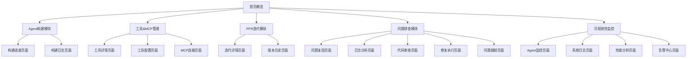
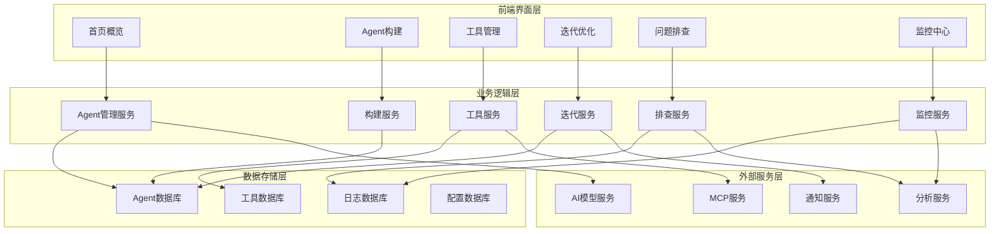
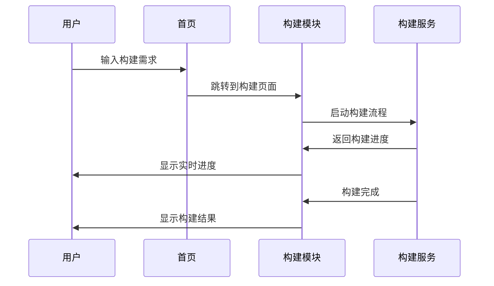
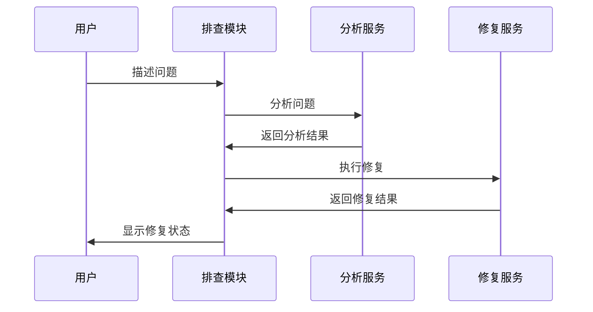
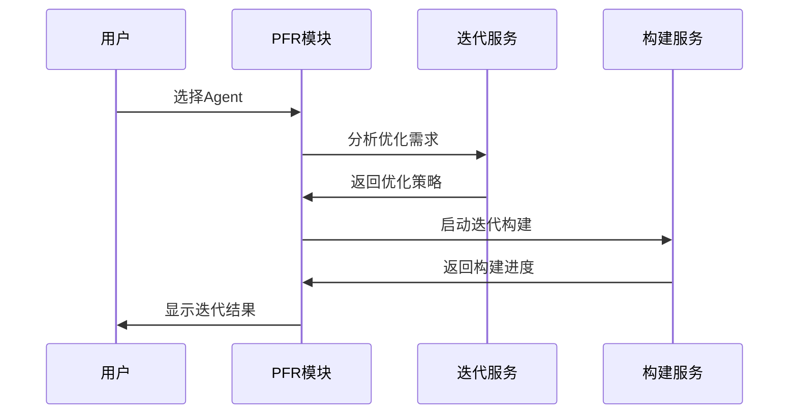
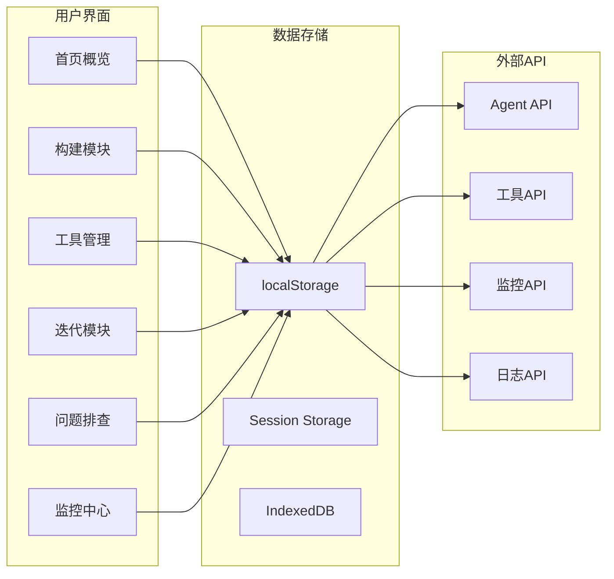

# Nexus-AI Platform 项目总结报告

## 项目概述

Nexus-AI Platform 是一个综合性的AI代理管理平台，提供了从构建、部署、监控到迭代优化的完整生命周期管理。本项目包含多个功能模块，每个模块都有独立的页面和功能，同时通过统一的导航系统实现模块间的无缝切换。

## 核心功能模块

### 1. 首页概览模块 (`00.homepage_overview.html`)
**功能描述**: 系统总览和快速入口
- 系统统计信息展示
- 快速构建Agent入口
- 活跃Agent列表
- 系统状态监控

**主要特性**:
- 响应式仪表板设计
- 实时数据展示
- 快速操作入口
- 系统健康状态监控

### 2. Agent构建模块 (`01.AgentBuildModule.html`)
**功能描述**: Agent构建和管理
- 10个Agent的构建工作流
- 构建进度跟踪
- 关键提示信息展示
- 版本管理

**主要特性**:
- 多阶段构建流程
- 实时进度更新
- 构建日志查看
- 版本历史管理

### 3. 工具&MCP管理模块 (`03.Tools&MCP.html`)
**功能描述**: 工具和MCP连接管理
- 工具导入和创建
- MCP连接管理
- 工具配置和测试
- 日志查看

**主要特性**:
- 工具分类管理
- 实时测试功能
- 配置管理
- 日志追踪

### 4. PFR迭代模块 (`04.PFR.html`)
**功能描述**: 基于反馈的迭代优化管理
- Agent选择和管理
- 统计信息展示
- 迭代策略选择
- 版本历史跟踪

**主要特性**:
- 多Agent管理界面
- 智能分析功能
- 策略选择
- 版本对比

### 5. 问题排查模块 (`troubleshoot.html`)
**功能描述**: 智能问题排查系统
- 自然语言问题描述
- Agent选择
- 多阶段排查流程
- 实时状态跟踪

**主要特性**:
- 用户友好的界面设计
- 多Agent协作排查
- 实时进度展示
- 详细日志分析

### 6. 可观测性监控模块 (`06.AgentOps.html`)
**功能描述**: 系统监控和日志管理
- 系统概览仪表板
- Agent状态监控
- 实时日志流
- 性能分析

**主要特性**:
- 实时数据展示
- 多维度监控
- 日志过滤和导出
- 性能图表

## 页面关系图



## 系统架构图



## 技术特性

### 1. 统一的设计系统
- **颜色方案**: 主色调使用渐变蓝紫色 (#667eea 到 #764ba2)
- **毛玻璃效果**: 所有卡片和面板使用 `backdrop-filter: blur(10px)`
- **圆角设计**: 统一的20px圆角
- **阴影效果**: 柔和的阴影增强层次感

### 2. 响应式设计
- 网格布局自适应不同屏幕尺寸
- 移动端友好的交互设计
- 灵活的组件排列

### 3. 交互体验
- 悬停效果和动画过渡
- 实时数据更新
- 状态反馈和通知系统
- 加载状态管理

### 4. 数据管理
- localStorage 用于页面间数据传递
- 统一的状态管理
- 数据持久化

## 功能流程

### 1. Agent构建流程


### 2. 问题排查流程


### 3. 迭代优化流程


## 数据流图



## 页面导航系统

### 导航结构
```
核心模块
├── 首页概览 (🏠)
├── 构建模块 (🔨)
├── 管理模块 (⚙️)
├── 迭代模块 (🔄)
├── 问题排查 (🐛)
├── 运维管理 (🔧)
├── 监控中心 (📊)
└── 工具&MCP (🛠️)

系统功能
├── Agent库 (🤖)
├── 多Agent编排 (🔗)
├── 自举式进化 (🔄)
└── 系统分析 (📈)

用户管理
├── 个人中心 (👤)
├── 团队管理 (👥)
├── 帮助文档 (📚)
└── 系统设置 (⚙️)
```

### 导航特性
- 统一的页面映射系统
- 状态指示器（在线/离线/构建中）
- 徽章显示（数量/状态）
- 响应式导航栏

## 开发规范

### 1. 代码结构
- 统一的CSS类命名规范
- 模块化的JavaScript函数
- 响应式设计模式
- 组件化开发

### 2. 文件组织
```
Tech Design/UI/
├── 00.homepage_overview.html    # 首页概览
├── 01.AgentBuildModule.html     # Agent构建模块
├── 03.Tools&MCP.html           # 工具&MCP管理
├── 04.PFR.html                 # PFR迭代模块
├── 06.AgentOps.html            # 可观测性监控
├── troubleshoot.html           # 问题排查主页面
├── troubleshoot-*.html         # 问题排查子页面
└── 项目总结报告.md             # 本文档
```

### 3. 命名规范
- 页面文件：功能描述.html
- CSS类：功能-元素-状态
- JavaScript函数：动词+名词
- 变量：驼峰命名法

## 未来扩展

### 1. 功能扩展
- 更多Agent类型支持
- 高级分析功能
- 自动化运维
- 多租户支持

### 2. 技术升级
- 前端框架集成（React/Vue）
- 状态管理（Redux/Vuex）
- 组件库建设
- 微前端架构

### 3. 性能优化
- 代码分割
- 懒加载
- 缓存策略
- CDN部署

## 总结

Nexus-AI Platform 成功实现了一个功能完整、设计统一的AI代理管理平台。通过模块化的设计和统一的导航系统，用户可以在不同功能模块间无缝切换，完成从Agent构建到监控运维的完整生命周期管理。

项目的主要成就：
1. **完整的业务流程覆盖**：从构建到监控的全生命周期管理
2. **统一的用户体验**：一致的设计语言和交互模式
3. **模块化架构**：便于维护和扩展的代码结构
4. **响应式设计**：适配不同设备和屏幕尺寸
5. **实时数据展示**：动态更新和状态反馈

该平台为AI代理的管理和运维提供了强大的工具支持，具有良好的可扩展性和维护性，为未来的功能扩展和技术升级奠定了坚实的基础。
